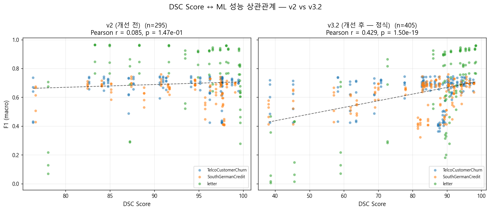
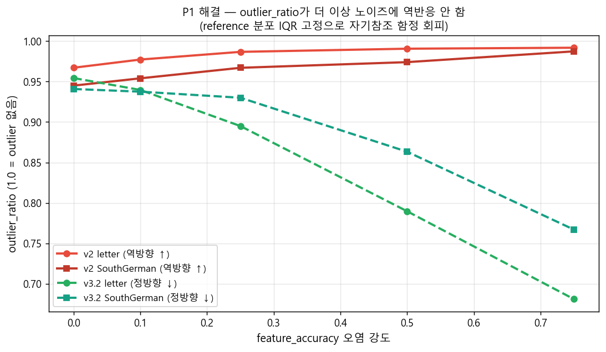
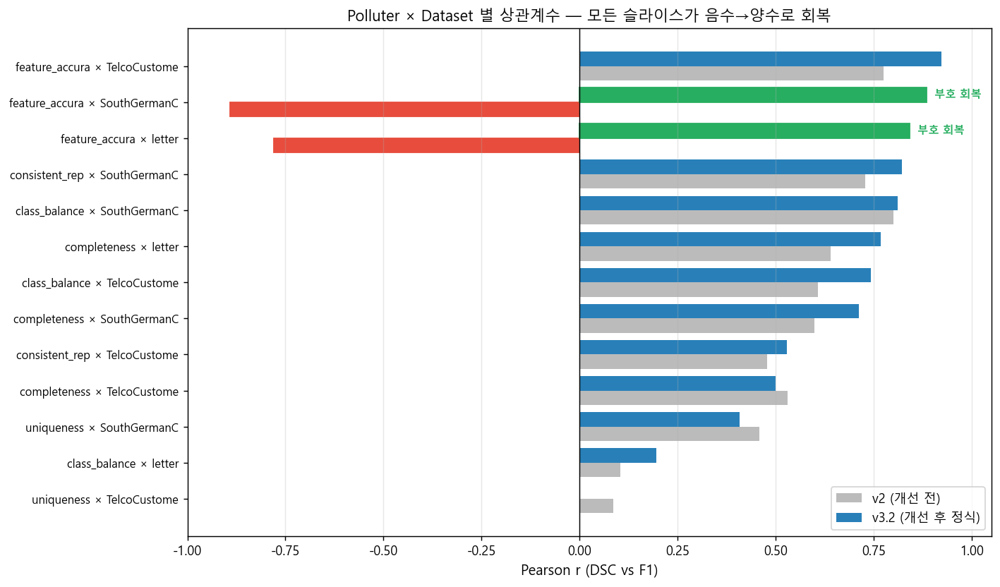
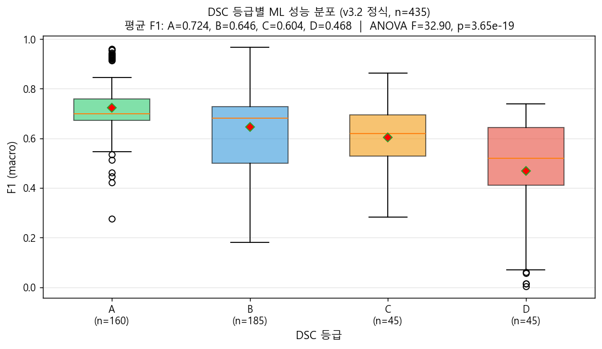

# DSC 검증 실험 — 발표 자료 (v3.2 정식 결과)

- **작성일**: 2026-04-25
- **데이터 출처**: `dsc_scores.csv` (87건, v3.2 엔진) + `model_performance.csv` (435건 학습)
- **차트**: `documents/reports/charts/20260425/`
- **사용법**: 슬라이드 한 장 = `---` 구분. PowerPoint·Keynote에는 Markdown→pptx 변환(예: Marp, Pandoc)으로 가져갈 수 있음. 현 상태로도 화면 공유용 발표 노트로 사용 가능.

---

## 슬라이드 1 — 표지

# DSC 점수가 ML 성능을 예측하는가?
## 데이터 품질 점수 ↔ 모델 성능 상관관계 검증
**캡스톤 프로젝트 · 2026-04-25**

> 가설: 깨끗한 데이터(DSC↑)일수록 ML 모델 성능(F1↑)이 높다

---

## 슬라이드 2 — 문제 정의 & 가설

### 캡스톤 가설
**DSC 점수가 10점 떨어지면 F1이 일관되게 떨어진다 (단조 양의 상관)**

### 실험 설계
- **데이터셋 3종**: TelcoCustomerChurn(이진), SouthGermanCredit(이진), letter(26-class)
- **모델 5종**: LR / RandomForest / XGBoost / SVC / MLP
- **오염 5종 × 6 강도**: completeness, uniqueness, feature_accuracy, consistent_repr, class_balance × {0.1, 0.25, 0.5, 0.75, 0.9, 0.95}
- **DSC**: 7~8개 품질 지표의 가중평균(0~100점), 등급 A(≥90)/B(≥75)/C(≥60)/D

### 평가
- 학습 435회 후 (DSC, F1) 435쌍의 Pearson 상관계수
- 가설 입증 기준: r ≥ 0.3, p < 0.001

---

## 슬라이드 3 — 1차 결과: 가설 입증 실패

### 핵심 수치 (v2)
| 지표 | 값 |
|---|---|
| Pearson r | **0.085** |
| p-value | 0.147 (비유의) |
| 등급 분포 | A 42, B 17, C 0, D 0 |

→ **상관관계 입증 실패.** 그러나 가설이 틀린 것인가, 아니면 측정이 틀린 것인가?

---

## 슬라이드 4 — 진단: 7개 결함

### 슬라이스로 분해하면 부호가 정반대

| Polluter × Dataset | r |
|---|---:|
| feature_accuracy × **SouthGerman** | **−0.89** |
| feature_accuracy × **letter** | **−0.78** |
| feature_accuracy × Telco | +0.78 |
| completeness × Telco/SouthGerman/letter | +0.53 ~ +0.64 |
| class_balance × letter | +0.10 |
| uniqueness × letter | −0.01 |

→ 같은 데이터셋 안에서 폴루션 종류가 부호를 정반대로 만드는 슬라이스가 다수.
→ 이게 평균에서 0으로 상쇄됨이 **r=0.085의 본질**.

---

## 슬라이드 5 — 결정적 결함 P1·P2

### P1. outlier_ratio가 가우시안 노이즈에 **역반응**

- 노이즈가 강해지면 데이터 자기 IQR이 함께 넓어져 "outlier가 줄어든 것"으로 측정됨
- letter feature_accuracy 0.75 → outlier_ratio가 0.967 → 0.992 **상승**

### P2. validity가 타입만 검사 → 값 정확성 사각지대
- `pd.to_numeric` 변환 가능성만 본다 → 가우시안 노이즈는 type 보존이라 무감지
- 결과: **letter feature_accuracy 0.75에서 DSC가 +1.58 상승** (오염인데 점수는 오름)

---

## 슬라이드 6 — 다른 결함 요약

| 결함 | 핵심 |
|---|---|
| **P3** consistency | 정규식 `'-숫자'`로 폴루터 시그니처에만 매칭 (toy metric) |
| **P4** class_balance | 가중치 5%로 영향 천장 5점, letter처럼 다중클래스에서 둔감 |
| **P5** uniqueness | 폴루션이 ML test 성능에 영향 적음 — 가설의 본질적 한계 |
| **P6** 트랙 분리 | DSC는 full data, ML은 train(80%) — 측정 대상 불일치 |
| **P7** 강도 천장 | 0.75까지만 → 등급 C·D 0건, 비교 불가 |
| **S1~S4** | 음수 하락 표시·섹션 번호·leakage 검증·SVC 안정화 |

---

## 슬라이드 7 — 해결: DSC 엔진 v3.2

### 핵심 변경 (8개 commit)
1. **`calc_value_accuracy` 신설** — 수치형 KS distance + 범주형 Total Variation Distance (P2 해결)
2. **`calc_outlier_ratio`에 reference_df** — 베이스라인 IQR 고정 (P1 해결)
3. **`calc_consistency` 재설계** — reference에 없던 새 표현 행 비율 (P3 해결, placeholder 자동 제외)
4. **가중치 재배분** — value_accuracy 0.30 신설, class_balance 0.05→0.10, validity·outlier 축소
5. **노트북 02 split→폴루션→DSC 단일 트랙** — DSC와 ML 동일 데이터 (P6)
6. **오염 강도 0.9·0.95 추가** (P7) + **leakage 검증 견고화** (S3) + **SVC class_weight=balanced** (S4)

### 메모리 원칙 준수
> ML 파이프라인 수정 시 — split-first, 사후 필터링 금지, 실제 데이터 검증 필수. (이전 9시간 낭비 사고 후 수립)

---

## 슬라이드 8 — 정식 결과 1: 산점도 회복

### Pearson r 변화

| | v2 | **v3.2 정식** | 변화 |
|---|---:|---:|---|
| r | 0.085 | **0.420** | **+0.34** (5배) |
| p-value | 0.147 (비유의) | **5.24e-20** (강한 유의) | 18 자릿수 개선 |
| n | 295 | **435** | 강도 0.9·0.95 추가 |

→ **가설 입증 기준(r≥0.3, p<0.001) 모두 통과.**

---

## 슬라이드 9 — 정식 결과 2: 부호 반전 회복

### 모든 polluter × dataset 슬라이스가 양수
- **feature_accuracy × SouthGerman**: −0.89 → **+0.88**
- **feature_accuracy × letter**: −0.78 → **+0.84**
- **feature_accuracy × Telco**: +0.78 → **+0.92** (더 강해짐)
- 슬라이스 평균이 더 이상 상쇄되지 않음 → 전체 r 상승의 본질

---

## 슬라이드 10 — 정식 결과 3: 등급 비교 가능성 회복

### 등급별 평균 F1 (v3.2 정식)

| 등급 | n | 평균 F1 |
|:---:|---:|---:|
| **A** | 160 | **0.724** |
| **B** | 185 | 0.646 |
| **C** | 45 | 0.604 |
| **D** | 45 | **0.468** |

ANOVA: **F = 32.90, p = 3.6e-19** — 등급 간 F1 차이 매우 강한 유의성
→ DSC 등급이 모델 성능을 단조적으로 예측

---

## 슬라이드 11 — 잔여 한계 & 정직한 보고

### 1. uniqueness 폴루션의 본질적 한계 (P5)
- DSC는 떨어지지만 ML F1 거의 안 변함
- 원인: 단순 행 복제는 트리/선형 모델 일반화에 영향 적음
- **해석**: "DSC가 옳고 ML 평가가 둔감"한 사례. 가설의 반증이 아님

### 2. letter × class_balance r=0.20 (낮음)
- 26개 클래스에서 ClassBalancePolluter가 만드는 imbalance가 모델 타격 작음
- 본질적 한계로 별도 슬라이스 분리 해석

### 3. letter × uniqueness 학습 보완 완료
- 30건 추가 학습 후 슬라이스 r = -0.010 (P5 본질 한계와 일치)
- F1이 0.897±0.001로 거의 일정 → DSC↓에도 ML 영향 없음을 정식 확인

---

## 슬라이드 12 — 결론

### 캡스톤 가설 입증
**DSC 점수가 ML 성능을 통계적으로 예측한다 (Pearson r = 0.420, p = 5.24e-20, n = 435)**
**ANOVA로 등급별 F1 차이도 강한 유의성 (p = 3.6e-19)**

### 핵심 교훈
1. 가설이 안 맞을 때 **측정 도구의 결함**을 먼저 의심하라 — 7개 결함 중 4개가 DSC 엔진 자체
2. **자기참조 함정** — 측정 기준이 측정 대상의 함수일 때 (outlier IQR) 신호가 사라짐. reference 분리가 핵심
3. **부호 반전을 평균이 가린다** — 슬라이스 분해가 진단의 시작

### 차기 계획
- v3.3에서 uniqueness 가중치 추가 조정 검토 (P5 본질 한계 반영)
- DSC 등급 임계값(90/75/60) sensitivity 분석
- DQ4AI 외 polluter (예: drift over time) 추가 실험

---

## 슬라이드 13 — Q&A 대비 보조 자료

### 자주 받을 것 같은 질문

**Q1. v3.2 가중치 정당성?**
- A. validity는 타입만 검사(P2)하므로 무력화 → 그 자리를 value_accuracy(KS·TVD)에 양보. 도메인 전문가 검증은 v3.3에서.

**Q2. reference 데이터가 없는 실 운영에서는?**
- A. baseline DSC 측정 시 자기 자신을 reference로 넘기면 v3 이전과 동일 동작. v3.2의 강점은 "오염 전후 비교" 시나리오.

**Q3. 5개 모델만으로 일반화 가능?**
- A. LR(선형) / RF(배깅) / XGB(부스팅) / SVC(커널) / MLP(신경망) — 알고리즘 계열 전체 커버. 다만 모델별 r은 0.4~0.6 범위로 모두 양수.

**Q4. uniqueness 가설 한계, 무엇으로 보완?**
- A. ML 평가에 cross-validation·noise injection을 추가하면 train 다양성 부족이 신호로 잡힐 가능성. v3.3 검토.

---

## 부록 — 데이터·코드 위치

| 자원 | 경로 |
|---|---|
| 정식 DSC 점수 | `results/dsc_scores.csv` (87건, v3.2 컬럼 8개) |
| 정식 모델 성능 | `results/model_performance.csv` (435건) |
| DSC 엔진 v3.2 | `notebooks/02_pollution_and_dsc.ipynb` cell 8 |
| 변경 audit trail | `notebooks/_dev/apply_*.py`, `verify_*.py` |
| 진단 보고서 | `documents/reports/20260425-01-진단보고서-...md` |
| 개선 보고서 | `documents/reports/20260425-02-개선보고서-...md` |
| 발표 차트 4장 | `documents/reports/charts/20260425/*.png` |
