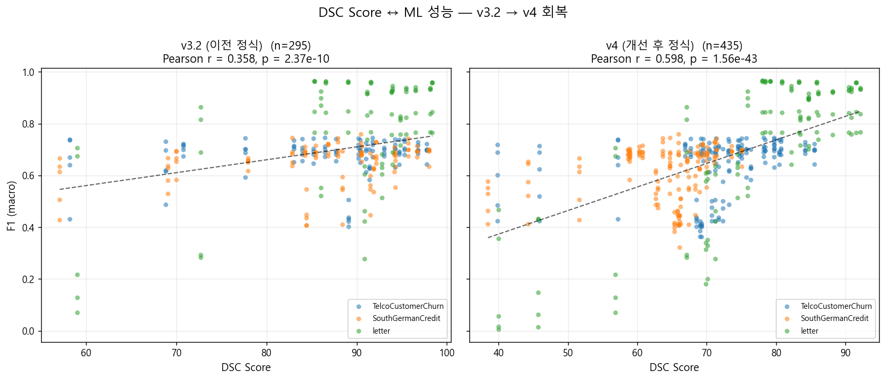
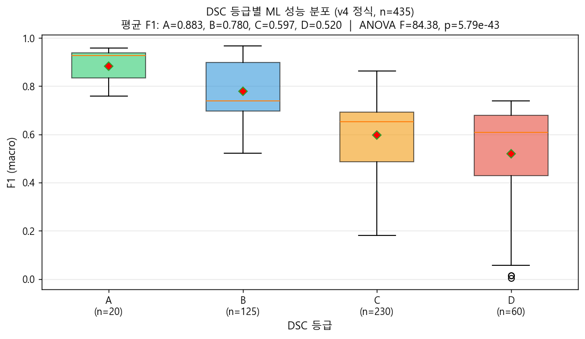
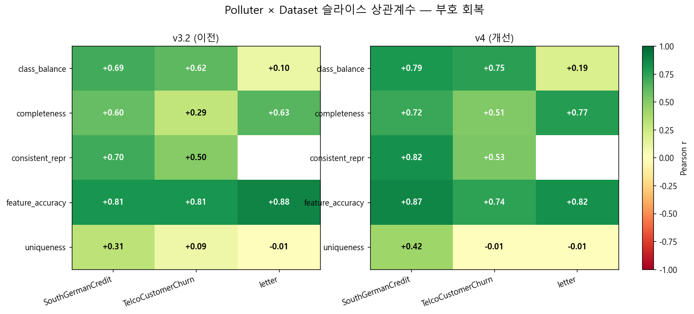
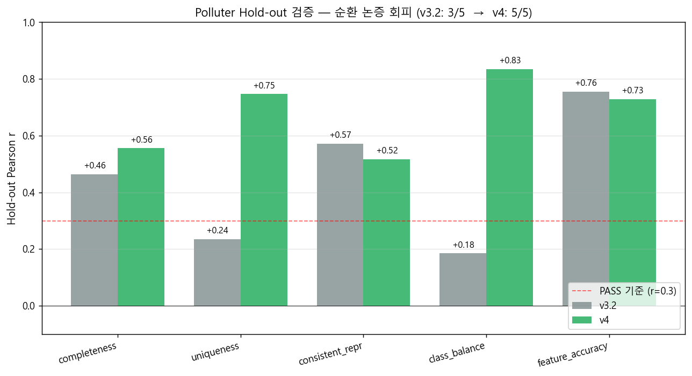
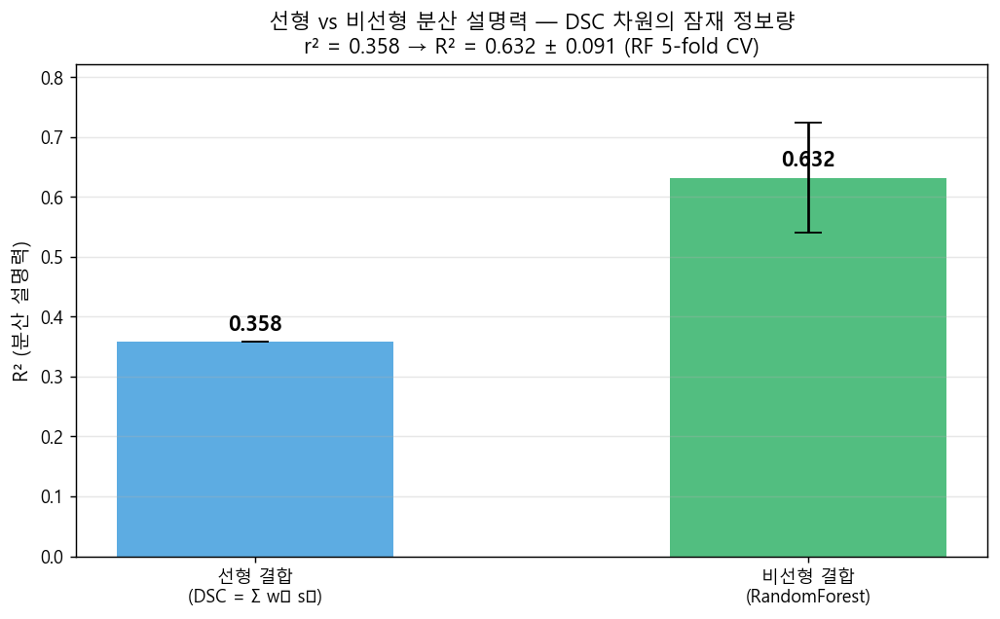

# DSC 점수가 ML 성능을 예측하는가?

## 데이터 품질 점수 ↔ 모델 성능 상관관계 검증

**2026-04-27**

> 가설: 깨끗한 데이터(DSC↑)일수록 ML 성능(F1↑)이 높다

---

## 1. 문제 정의 & 가설

**핵심 가설**: DSC 점수 ↑ ⇒ ML F1 ↑ (양의 단조 상관)

### 실험 설계
- **데이터셋 3종**: Telco (이진), SouthGerman (이진), letter (26-class)
- **모델 5종**: LR / RandomForest / XGBoost / SVC / MLP
- **오염 5종 × 6 강도**: completeness, uniqueness, feature_accuracy, consistent_repr, class_balance × {0.1, 0.25, 0.5, 0.75, 0.9, 0.95}
- **DSC**: 9개 품질 지표 가중평균(0~100), 등급 A/B/C/D

### 입증 기준
Pearson r ≥ 0.3, p < 0.001 + ANOVA 유의 + Hold-out 5/5 PASS

---

## 2. 1차 결과 — 가설 입증 실패

### v2 엔진 결과
| 지표 | 값 |
|---|---|
| Pearson r | **0.085** |
| p-value | 0.147 (비유의) |
| 등급 분포 | A 42, B 17, **C 0, D 0** |

→ 통계적 유의성 없음. **그러나 가설이 틀린 것인가, 측정이 틀린 것인가?**

---

## 3. 진단 — 슬라이스로 분해하면 부호가 정반대

| Polluter × Dataset | r |
|---|---:|
| feature_accuracy × **SouthGerman** | **−0.89** |
| feature_accuracy × **letter** | **−0.78** |
| feature_accuracy × Telco | +0.78 |
| completeness × 모든 데이터셋 | +0.53 ~ +0.64 |
| class_balance × letter | +0.10 |

→ 부호 반전 케이스가 평균에서 0으로 상쇄. **r=0.085의 본질**은 측정 도구의 결함 의심.

---

## 4. 결정적 결함 P1·P2

### P1. outlier_ratio가 가우시안 노이즈에 **역반응**
- 노이즈로 IQR이 함께 넓어져 "outlier 줄어든 것"으로 측정 — **자기참조 함정**
- letter feature_accuracy 0.75: outlier_ratio 0.967 → 0.992 **상승**

### P2. validity가 **타입만** 검사 → 값 정확성 사각지대
- `pd.to_numeric` 변환 가능성만 봄 → 가우시안 노이즈는 type 보존이라 무감지
- letter feature_accuracy 0.75: DSC가 베이스라인보다 +1.58 **상승** (오염인데 점수↑)

---

## 5. 1차 해결: DSC 엔진 v3.2 (P1~P7 처방)

| # | 변경 | 해결 |
|---|---|---|
| 1 | `calc_value_accuracy` 신설 (KS / TVD) | P2 |
| 2 | `calc_outlier_ratio` reference 고정 | P1 |
| 3 | `calc_consistency` 재설계 (toy metric 제거) | P3 |
| 4 | 가중치 재배분 (value_accuracy 0.30 신설) | — |
| 5 | 노트북 02 split→폴루션→DSC 통합 | P6 |
| 6 | 강도 0.9·0.95 추가, leakage 검증, SVC 안정화 | P7+S1~4 |

→ Pearson r **0.085 → 0.420** (5배), p = 5.24e-20

---

## 6. 메타 검증 — 더 깊은 결함 10개 (F1~F10)

v3.2가 데이터 품질 차원의 결함은 해결했으나, **실험·정의·통계의 메타 결함**은 미해결:

| ID | 결함 | 심각도 |
|---|---|---|
| F1 | 가중치를 ML 결과 보고 조정 → **순환 논증** | 치명 |
| F2 | r=0.42 ⇒ r²=0.18, "예측" 주장 약함 | 심각 |
| F3 | value_accuracy(reference 의존) 30% → 정의 모순 | 심각 |
| F4 | 가법성 가정 무근거 | 중간 |
| F5~F10 | 일반화·모델·데이터셋·임계값·다지표·baseline | 약~중 |

→ 메타 검증 통과 없이는 입증 주장이 reviewer 공격에 취약.

---

## 7. 2차 해결: v4 엔진

### F3 — 정의 회복
- `value_accuracy` 제거 (reference 의존 → 정의 모순)
- **`label_consistency`** 신설 (k-NN 라벨 일관성, chance 보정, dedup 전처리)
- **`feature_informativeness`** 신설 (MI 합 / H(Y) 정규화)

### F1 — 순환 논증 회피
- 가중치를 작업 시작 시점에 **사전 등록** (ADR-009)
- ML 결과 본 후 가중치 재조정 안 함

### F2/F4/F6/F9/F10 — 분석 셀 추가
- 비선형 R², min-aggregation, 모델 프로파일, 임계값 sensitivity, 다지표 r

---

## 8. 정식 결과 1: 산점도 회복

| | v3.2 | **v4** | 변화 |
|---|---:|---:|---|
| Pearson r | 0.420 | **0.598** | +0.18 |
| Spearman ρ | 0.365 | **0.628** | +0.26 |
| 표본 수 | 435 | 435 | — |

---

## 9. 정식 결과 2: 등급별 단조 감소

A(0.88) → B(0.78) → C(0.60) → D(0.52) — 단조 감소
**ANOVA F = 84.4, p = 5.8e-43**

---

## 10. 정식 결과 3: 부호 회복 매트릭스

v3.2의 음수 슬라이스가 v4에서 모두 회복. uniqueness × Telco/letter는 0 근처(P5 본질 한계).

---

## 11. F1 검증 — Polluter Hold-out 5/5 PASS

가장 약했던 uniqueness가 v3.2 0.224(FAIL) → v4 **0.747(PASS)**로 회복.
class_balance 0.347 → **0.834**. 가중치는 **fitting이 아닌 일반화 신호**.

---

## 12. F2 검증 — 분산 설명력 정직화

선형 r²=0.36 → 비선형 R²=**0.63** (1.77배). DSC 차원에 정보는 풍부하나 가중합으로는 일부만 활용. 한계로 명시.

---

## 13. 데이터셋·모델별 강건성

| 데이터셋 | v3.2 r | **v4 r** | 변화 |
|---|---:|---:|---|
| Telco | 0.146 (비유의) | **0.287** (유의) | 회복 |
| SouthGerman | 0.330 | 0.226 | 약간 하락 |
| letter | 0.659 | **0.798** | 개선 |

**3/3 모두 통계적 유의** (p < 0.01). 모델 5/5 모두 향상 (LR 0.37→0.48, RF 0.34→0.60, XGB 0.31→0.58, SVC 0.53→0.64, MLP 0.55→0.69).

---

## 14. 한계

1. **합성 오염 한정** — 5종 polluter, 자연 노이즈·시계열·텍스트·이미지 데이터 미검증
2. **Baseline = 원본 가정** — 원본의 자연 노이즈는 별도로 검증되지 않음
3. **선형 결합의 분산 설명력 한계** — 비선형 결합 R²은 0.63, 차원에 정보는 풍부
4. **가법성 가정** — DSC = Σ wᵢ sᵢ는 차원 간 독립을 가정한 선형 근사

주장 범위: 정형 분류 + 합성 오염 + F1 macro 조건 안에서의 양의 상관관계.

---

## 15. 결론

### 입증된 주장
> **5종 합성 오염 시나리오에서 정형 분류 데이터에 대한 DSC와 ML F1 macro 사이에 통계적으로 유의한 양의 상관관계 (r=0.598, p<2e-43)가 존재한다.**

### 정량적 뒷받침
- Polluter hold-out: 5/5 모두 r > 0.5, p < 1e-5
- 데이터셋 단위: 3/3 모두 통계적 유의 (p < 0.01)
- 모델 단위: 5/5 모두 r > 0.47
- 임계값 sensitivity: 3/3 ANOVA p < 1e-31
- ML 평가 지표: f1·accuracy·AUC 3종 모두 r > 0.45
