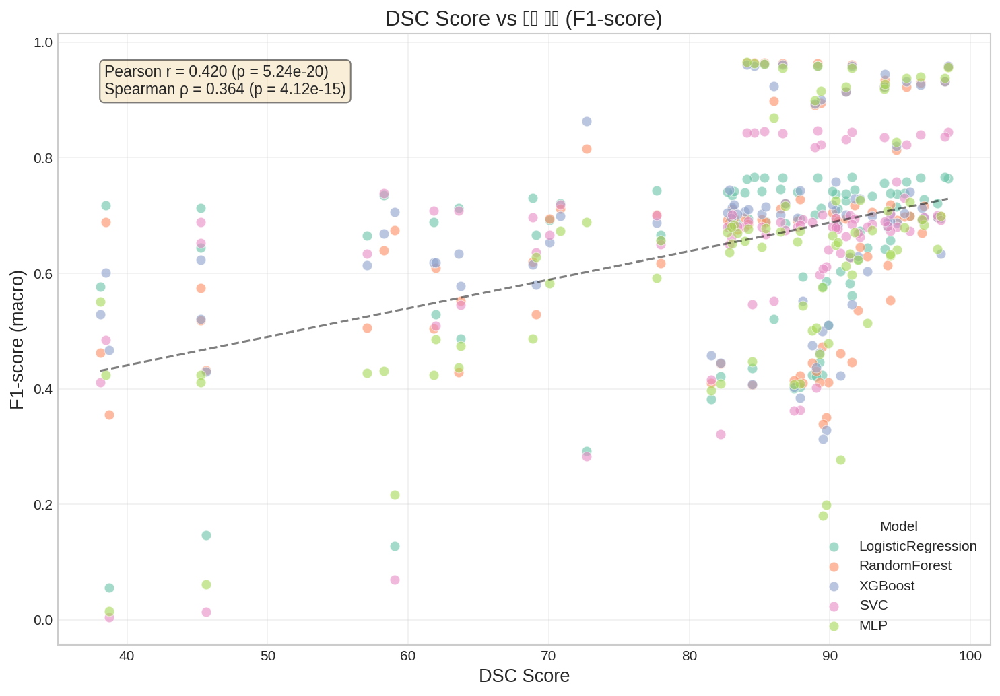
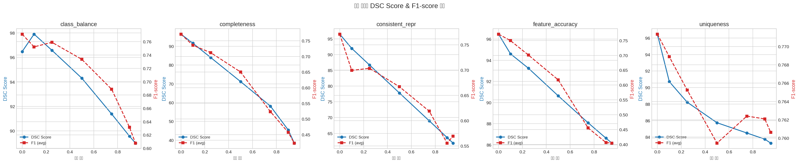
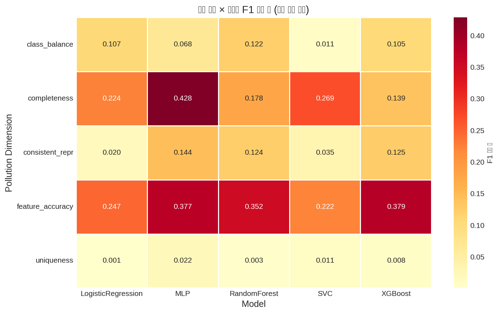
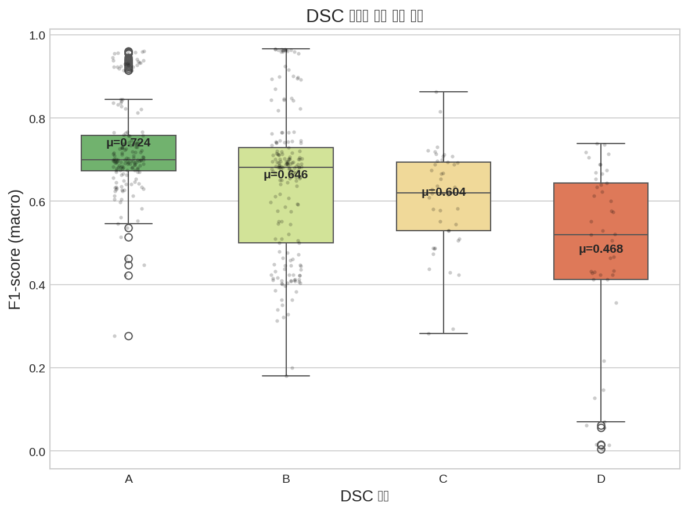
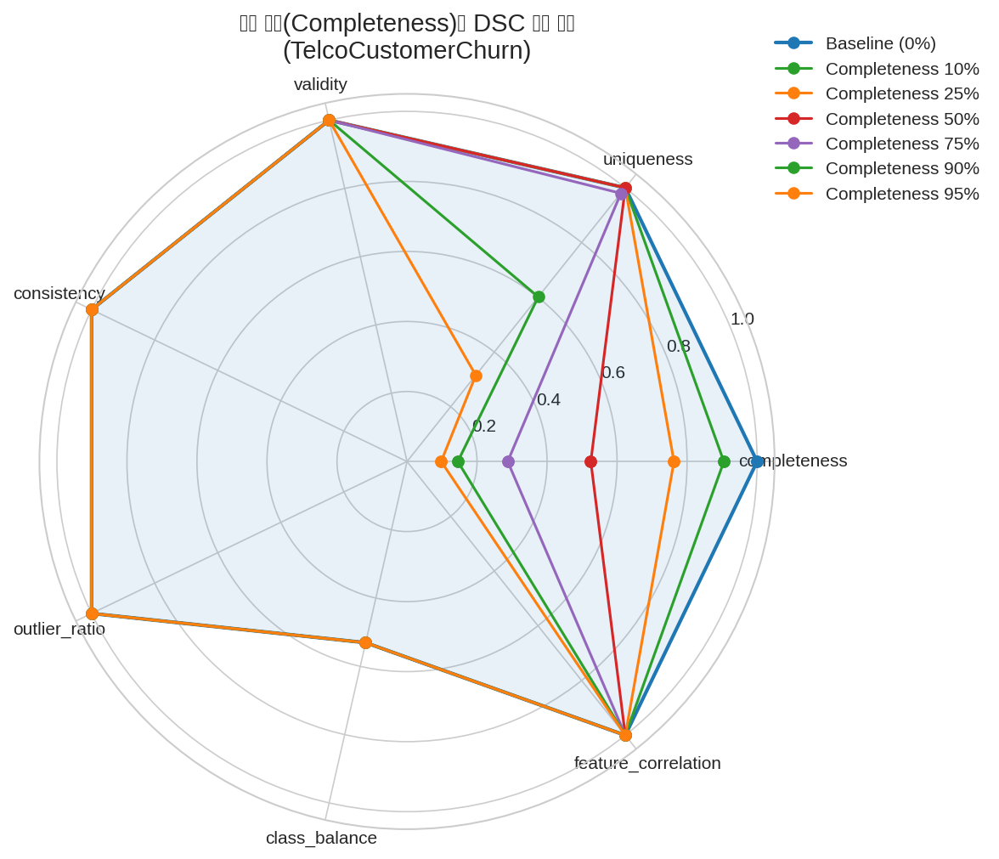

# DSC 검증 프로젝트

---

## 0. 이 글의 구조

```
1부 — 문제 정의 (가설)
2부 — 우리가 만든 것 (DSC 점수 시스템 + 검증 실험 디자인)
3부 — 검증 여정 (1차 실패 → 진단 → v3.2 → v4)
4부 — 최종 결과 (차트 5장 풀이 + 정직한 한계)
5부 — 지금 만들고 있는 v5 (어디까지 왔고 뭐가 남았나)
6부 — 한 줄 요약
```

부록은 별도 파일 (`20260428-02-DSC-용어집-FAQ.md`).

읽기 팁:

- 차트 그림은 4부에 
- 4부까지가 "끝난 일", 5부가 "지금 진행 중이고 아직 안 돌린 일".

---

## 1부. 문제 정의

본 캡스톤의 검증 가설:

> **H₁: 데이터셋의 DSC 점수와 그 데이터셋으로 학습한 ML 모델의 성능 사이에 통계적으로 유의한 양의 상관관계가 존재한다.**

용어:

- **DSC (Data Score Card)** — 데이터셋 D를 받아 [0, 100] 점수와 등급을 반환하는 함수. 정의식 `DSC(D) = Σ wᵢ · metric_i(D)`. 9개 metric의 가중합. 자세한 정의는 2부.
- **ML 성능** — 분류 모델 평가 지표 (F1 macro 메인, accuracy/AUC 보조). 2.8 참조.

이 캡스톤의 본질은 DSC를 만드는 것보다 **DSC 점수가 ML 성능과 함께 움직임을 실증**하는 것. 검증 통과 못 하면 우리가 정의한 DSC는 임의의 숫자에 불과.

📖 **상관 (correlation)** — 두 변수가 같이 움직이는 정도. 한 변수가 커질 때 다른 변수도 커지면 양의 상관, 반대면 음의 상관. 흔한 측정값이 Pearson r (−1 ~ +1).

📖 **유의 (statistically significant)** — 관측된 패턴이 우연이 아니라고 통계적으로 말할 수 있는 수준. p값(우연일 확률)이 0.001 이하면 보수적 기준에서 유의.

---

## 2부. 우리가 만든 것

### 2.1 DSC의 구조 한눈에

DSC는 데이터셋 `D`를 받아 `[0, 100]` 점수와 등급(A/B/C/D)을 반환하는 함수.

```
D ─► [9개 metric 계산] ─► [정규화 0~1] ─► [가중합] ─► score(0~100) ─► 등급
```

각 metric은 데이터셋의 한 측면을 0~1 점수로 측정. 9개 가중합 → 0~100 점수 → 등급.

```
A:  90 이상
B:  75 ~ 90
C:  60 ~ 75
D:  60 미만
```

### 2.2 9개 metric — 각각 무엇을 측정하나

| # | metric | 무엇을 측정 | 어떻게 계산 |
|---|---|---|---|
| 1 | `completeness` | 결측값이 적은가 | `1 − n_missing / n_total` |
| 2 | `uniqueness` | 중복 행이 적은가 | `1 − n_duplicate / n_total` |
| 3 | `validity` | 타입/형식이 맞는 비율 | `1 − n_format_error / n_total` |
| 4 | `consistency` | 같은 범주값의 표기가 일관되나 (예: "Male" / "male" / "M") | 범주값 정규화 후 일치 비율 |
| 5 | `outlier_ratio` | IQR 기준 이상치 비율의 역 | `1 − n_outlier / n_total`, **단 IQR은 baseline 데이터셋의 IQR로 고정** (3부 P1 참조) |
| 6 | `class_balance` | 타겟 클래스 분포 균형도 | `entropy(class_dist) / log(n_class)` |
| 7 | `feature_correlation` | 피처 간 거의 같은 정보를 가진 쌍이 적은가 | `1 − (\|corr\| > 0.95 인 쌍의 비율)` |
| 8 | `label_consistency` ⭐ | 결정 경계가 명확한가 (학습 가능성 직접 측정) | k=5 KNN으로 각 점의 이웃 5개 라벨 중 자기와 같은 비율 평균 |
| 9 | `feature_informativeness` ⭐ | 피처가 타겟에 정보량을 갖는가 | `mutual_info_classif` 평균 |

⭐ 표시 두 개 (`label_consistency`, `feature_informativeness`)가 v4에서 새로 도입된 핵심 지표. 다른 7개는 데이터의 형식적 품질만 보지만, 이 둘은 **"이 데이터로 모델이 학습 가능한가"를 직접 측정**. 도입 배경은 3부.

📖 **IQR (Interquartile Range)** — 데이터 정렬 시 25% 지점과 75% 지점 사이 너비. outlier 판정 표준 방법: `[Q1 − 1.5·IQR, Q3 + 1.5·IQR]` 범위 밖.

📖 **KNN (k-Nearest Neighbors)** — 한 점에서 가장 가까운 k개 이웃을 찾는 알고리즘.

📖 **mutual information** — 두 변수가 얼마나 의존적인지의 정보 이론 측정값. 한 변수를 알면 다른 변수의 불확실성이 얼마나 줄어드는가. 0이면 독립.

### 2.3 가중치

9개 점수의 가중합. 현재 default 가중치 (v4):

```
completeness:              0.20
uniqueness:                0.10
validity:                  0.05
consistency:               0.10
outlier_ratio:             0.05
class_balance:             0.10
feature_correlation:       0.05
label_consistency:         0.20    ⭐
feature_informativeness:   0.10    ⭐
                           ─────
total:                     1.00
```

⭐ 두 개 합 0.30 — 거의 1/3이 학습 가능성 지표. v3.2 → v4의 가장 큰 변화.

가중치를 결과 보고 조정하지 않는 게 검증 정직성에 핵심. 이유는 3.5절 (순환 논증) 참조.

### 2.4 어떻게 검증할 것인가 — 실험 디자인

DSC와 ML 성능의 상관을 보려면 두 값의 (DSC, ML 성능) 쌍을 많이 모아야 함. 자연 데이터의 변동 폭만으로는 부족하므로 **인위적으로 데이터를 오염시켜 두 값을 동시에 변화시키는** 방식 채택.

```
원본 데이터셋 D                    ┐
   ↓                              │
다양한 종류·강도로 오염             │  ← polluter (5종 × 4단계 강도)
   ↓                              │
오염된 D'들 (수십 개)               ┘
   ↓
각 D'에 대해:
   • DSC(D')        → 점수
   • train(D')      → 5개 모델 각각 학습
   • evaluate()     → 모델별 F1 (clean test로)
   ↓
(DSC, F1) 쌍 수백 개 ─► Pearson r, Spearman ρ, ANOVA, ...
```

오염을 직접 제어해서 DSC의 dynamic range를 확보 → 상관 측정에 적합한 분포.

### 2.5 데이터셋 3개

| 약칭 | 풀이름 | 행 수 | 피처 | 타겟 |
|---|---|---:|---|---|
| **Telco** | TelcoCustomerChurn | 7,043 | 수치+범주 혼합 | 이진 분류 (이탈/유지) |
| **Credit** | SouthGermanCredit | 1,000 | 수치+범주 혼합 | 이진 분류 (신용 양호/불량) |
| **letter** | Letter Recognition | 20,000 | 수치만 | 26-클래스 다중 분류 (알파벳) |

크기 (1K~20K), 피처 종류 (혼합/수치), 타겟 종류 (이진/다중) 의도적 분산. 한 데이터셋에서만 통하는 우연 차단 목적.

### 2.6 오염 종류 (polluter) 5개 × 강도 4단계

| polluter | 무엇을 망가뜨리나 | 강도 |
|---|---|---|
| `completeness` | 일부 셀을 NaN으로 변경 | 10% / 25% / 50% / 75% |
| `uniqueness` | 임의 행을 복제 추가 | 1.5x / 2.0x / 3.0x / 4.0x |
| `feature_accuracy` | 수치 피처에 가우시안 노이즈 주입 | 10% / 25% / 50% / 75% |
| `consistent_repr` | 범주값 표기 일부 변형 ("Yes"→"yes"). 범주형 있는 데이터셋만 | 10% / 25% / 50% / 75% |
| `class_balance` | 특정 클래스 비율 인위적 축소 | 10% / 25% / 50% / 75% |

DQ4AI 외부 오픈소스 라이브러리에서 가져온 polluter set. 학술적 reference 있음 (임의 정의 아님).

📖 **DQ4AI** — Hasso-Plattner-Institut(HPI)의 오픈소스. ML 학습 데이터에 표준화된 방식으로 오염 적용해 ML 성능 영향을 연구하는 도구.

📖 **가우시안 노이즈** — 평균 0, 표준편차 σ인 정규분포 `N(0, σ²)`에서 샘플링한 값. `feature_accuracy` polluter는 수치 피처 `v → v + N(0, σ·std(v))`로 변형 (σ가 강도). 자연 측정 오차의 가장 일반적 모델 — 중심극한정리에 의해 많은 독립 오차원의 합은 정규분포에 수렴해서, 센서 오차·신호 노이즈 대부분이 가우시안 근사 가능. 단, 자연계 모든 노이즈가 가우시안은 아님 (salt-and-pepper, dropout, heavy-tail 등은 별개) — 이건 한계 1번에 반영.

### 2.7 ML 모델 5개

알고리즘 계열 5종 모두 커버해서 "특정 모델 종류에서만 통한다"는 반박 차단.

| 모델 | 계열 |
|---|---|
| LogisticRegression | 선형 |
| SVC (linear kernel) | 커널 (선형) |
| RandomForest (n=100) | 배깅 트리 |
| XGBoost (n=100) | 부스팅 트리 |
| MLP (5 layer × 100 unit) | 신경망 |

### 2.8 평가 지표 — F1 macro 선택 근거

분류 모델 성능 평가 지표 선택은 결과 해석에 직접 영향. 우리는 **F1 macro를 메인**, accuracy / AUC-ROC를 보조로 함께 측정.

**F1 macro 선택 이유:**

- 데이터셋이 클래스 불균형 (Telco 26.5% churn, Credit 30% bad, letter 26 다중 클래스). accuracy 단독 사용 시 majority class에 다 찍어도 점수 인플레됨 (Telco를 모두 "유지"로 찍으면 accuracy 73.5%).
- F1 = precision · recall 조화평균 → 한쪽만 잘해도 점수 안 올라감.
- macro = 클래스별 F1 단순 평균 → 작은 클래스도 동등 가중. 클래스 크기 영향 제거.
- 클래스 불균형 분류에서 single-number 평가의 학계 표준 중 하나.

**F1 단독 의존하지 않음 (다지표 검증):**

| ML metric | Pearson r | Spearman ρ |
|---|---:|---:|
| F1 macro | **0.598** | 0.628 |
| accuracy | 0.496 | 0.540 |
| AUC-ROC | 0.456 | 0.630 |

세 지표 모두 양의 유의 상관 (p < 1e-23). F1이 r 가장 높아서 메인으로 선택했지만, 결과의 robustness는 셋 다 측정한 것으로 확보. 평가 지표 단일 의존 결함은 정직 회피.

📖 **F1 (macro)** — precision (예측한 양성 중 실제 양성 비율) 과 recall (실제 양성 중 예측한 양성 비율) 의 조화평균. 0~1, 1에 가까울수록 좋음. macro = 클래스별 F1 단순 평균.
📖 **AUC-ROC** — 분류기가 양성·음성을 얼마나 잘 구분하는가. 0.5는 랜덤, 1은 완벽.

### 2.9 분할·평가 — leakage 방지 원칙

ML 실험에서 train/test leakage(학습 데이터가 평가 데이터로 새는 것)는 결과를 무효로 만듬. 다음 원칙을 코드로 강제.

```
1. raw 데이터 D를 먼저 train/test로 split (8:2, stratified, seed=1)
2. polluter는 train 파트에만 적용
3. test는 모든 실험에서 동일한 clean test 재사용
4. 학습 직전 train ∩ test 인덱스 교집합 검증, 0이 아니면 RuntimeError
```

이걸 **split-first 원칙**이라 부름. 노트북 코드에 자동 검증 셀 박힘. 초기에 leakage로 실험 한 번 통째 무효화한 적 있어서 추가된 안전장치.

📖 **stratified split** — 분할 시 각 split이 원본의 클래스 비율을 유지. 클래스 불균형 데이터에서 한쪽에 쏠림 방지.

📖 **seed (=random_state)** — 난수 생성기 초깃값. 같은 seed → 같은 결과 재현. 우리는 1로 고정.

### 2.10 표본 수와 통계 산출

```
3 데이터셋
× (5 polluter × 4 강도 + 1 baseline)        ≈ 21 settings (범주형 없는 letter는 17)
× 5 모델
─────────────────────────────────────────
≈ 435 학습 (DSC×F1 쌍은 polluter setting 단위로 보면 87쌍)
```

이 표본에서 Pearson r, Spearman ρ, ANOVA로 상관 검정.

**산출식 / 구현:**

| 통계 | 정의 | 코드 |
|---|---|---|
| Pearson r | `cov(X, Y) / (σ_X · σ_Y)`. 두 변수의 공분산을 표준편차 곱으로 정규화. [-1, +1]. 선형 상관만 잡음. | `scipy.stats.pearsonr(x, y)` |
| Spearman ρ | `Pearson(rank(X), rank(Y))`. 값을 순위로 변환 후 Pearson 적용. 비선형 단조 관계까지 잡음. | `scipy.stats.spearmanr(x, y)` |
| p-value | H₀ "두 변수 무상관" 하에서 관측된 r이 우연히 나올 확률. t-분포 기반. 작을수록 H₀ 기각 강. | (위 함수에서 함께 반환) |
| ANOVA F | `MS_between / MS_within` = (그룹 간 평균 차의 분산) / (그룹 내 분산). MS = Mean Square. F가 클수록 그룹 간 차이가 그룹 내 변동 대비 압도적. | `scipy.stats.f_oneway(g1, g2, g3, g4)` |

라이브러리 함수 한 줄로 산출. 우리가 직접 구현한 부분은 데이터 변환과 표본 수집 파이프라인.

---

## 3부. 검증 여정 — 1차 실패에서 v4까지

3부는 이 프로젝트에서 가장 시간이 오래 걸린 부분. 흐름:

1. 처음 실험 → 가설 입증 실패 (r=0.085)
2. 데이터를 슬라이스로 쪼개 진단 → "DSC 정의 자체가 두 군데서 망가져 있었음"
3. 1차 수정 (DSC 엔진 v3.2) → r=0.420 (단, 가중치 사후 조정 → 결과 정당성 의심)
4. 메타 검증 → 실험 논리·통계 추론에 결함 10개 더 (가장 무거운 게 위의 가중치 조정 = 순환 논증)
5. 2차 수정 (DSC 엔진 v4) → r=0.598 + 모든 메타 결함 해소

### 3.1 1차 실험 결과 — 가설 입증 실패

처음 정의한 DSC (v2 엔진, metric 7개 가중합)로 2.4절 실험 실행. 결과:

| 통계 | 값 | 해석 |
|---|---|---|
| Pearson r | **0.085** | 사실상 0 (무상관) |
| p-value | 0.147 | 14.7% 확률로 우연 — 유의 안 됨 |
| 등급 분포 | A 42 / B 17 / **C 0 / D 0** | 75%까지 오염 줘도 점수가 충분히 안 떨어짐 |

가설 입증 실패. 다만 "가설 자체가 틀렸다"로 결론짓기 어려운 단서가 있었음 — **어떤 케이스에선 가설이 명백히 맞고, 어떤 케이스에선 정반대로 보였음**. 평균 시 상쇄돼서 0 근처가 나온 것.

### 3.2 슬라이스로 쪼개서 진단

(데이터셋, polluter) 쌍 단위로 r 재계산:

| (데이터셋, polluter) | r |
|---|---:|
| Telco × `feature_accuracy` | +0.78 (정방향, OK) |
| SouthGerman × `feature_accuracy` | **−0.89** (정반대) |
| letter × `feature_accuracy` | **−0.78** (정반대) |

음의 값 = "데이터를 더 오염시킬수록 DSC는 오히려 올라가고 ML 성능은 떨어진다". DSC가 잘못된 신호를 보낸 케이스.

같은 polluter인데 데이터셋에 따라 부호가 정반대인 건 통계적 우연으로 설명 불가. **DSC 정의 자체에 결함**이라는 진단.

### 3.3 결정적 결함 두 가지 (P1, P2)

음의 상관은 거의 다 `feature_accuracy` polluter (수치 피처에 가우시안 노이즈 주입) 케이스. 코드 추적 결과 두 결함 발견.

#### P1. `outlier_ratio` 가 자기 자신의 IQR을 기준으로 측정 (자기참조)

기존 구현:

```python
def outlier_ratio(D):
    Q1, Q3 = D.quantile(0.25), D.quantile(0.75)   # ← D 자신의 quantile
    iqr = Q3 - Q1
    outlier = (D < Q1 - 1.5*iqr) | (D > Q3 + 1.5*iqr)
    return 1 - outlier.mean()
```

문제: 노이즈를 주입하면 분산이 커지고, 분산이 커지면 IQR도 같이 넓어짐. IQR이 넓어지면 더 많은 점이 "정상 범위 안"으로 들어와서 outlier 비율이 **줄어든 것처럼** 측정됨. 노이즈가 강할수록 점수가 좋아지는 역설.

```
원본:        값 분포 좁음 → IQR 좁음 → 정상 범위 좁음 → outlier 5%
노이즈 75%:  값 분포 넓음 → IQR 넓음 → 정상 범위 넓음 → outlier 2% (?!)
```

판정 기준이 측정 대상에 따라 같이 변하는 self-referential bug.

#### P2. `validity` 가 "타입이 숫자인가"만 검사

```python
def validity(D):
    return (D.apply(lambda x: pd.to_numeric(x, errors='coerce').notna())).mean()
```

가우시안 노이즈는 100을 110으로 바꾸지 100을 "abc"로 바꾸지 않음. 노이즈 75% 강도여도 값은 여전히 숫자 → validity = 1.0 만점.

#### 두 결함의 합산 효과

`letter` × `feature_accuracy` 75% 케이스에서 **DSC 점수가 baseline보다 1.58점 높게** 측정. 더 더러운 데이터에 더 높은 점수. 1차 실패의 직접 원인.

### 3.4 1차 수정 — DSC 엔진 v3.2

P1·P2 포함 7가지 결함 처방. 핵심 변경 두 개:

**(1) `outlier_ratio` IQR 기준을 baseline 데이터로 고정**

```python
def outlier_ratio(D, baseline_iqr):
    Q1, Q3 = baseline_iqr  # ← 외부 주입, 측정마다 변하지 않음
    ...
```

판정 기준을 측정 대상으로부터 분리. self-reference 차단.

**(2) `value_accuracy` metric 신규 추가**

baseline 분포와 현재 분포의 거리 (KS distance) 직접 측정.

```python
def value_accuracy(D, D_baseline):
    return 1 - mean([ks_distance(D[col], D_baseline[col]) for col in numeric_cols])
```

P2에서 못 잡던 가우시안 노이즈를 분포 거리로 잡음.

📖 **KS distance (Kolmogorov-Smirnov)** — 두 분포의 누적분포함수 차이의 최댓값. 0(같음) ~ 1(완전 다름).

**v3.2 결과:**

| 통계 | v2 (1차) | **v3.2** | 변화 |
|---|---:|---:|---|
| Pearson r | 0.085 | **0.420** | 약 5배 |
| p-value | 0.147 | 5.24e-20 | 사실상 0 |
| 등급별 ANOVA F | — | 32.9 | 유의 |

표면상 가설 1차 입증. 단 **이 시점 v3.2 가중치는 r 결과를 보고 재조정한 값**이라 검증 정당성 자체에 의문 → 다음 절 메타 검증의 출발점.

### 3.5 메타 검증 — 더 깊은 결함 10개

v3.2는 **DSC가 측정하는 데이터 품질의 정의 결함**은 잡았지만, **실험 자체의 논리·통계적 추론**에 또 다른 결함 10개가 있었음. 학회 reviewer가 공격할 약점들. F1~F10으로 분류, 가장 무거운 것부터.

#### F1. 순환 논증 (가장 심각)

이게 우리 검증의 정직성을 가장 위협한 결함. 깊게 다룸.

**무엇이 문제였는가:**

v3.2 가중치를 정한 절차:

1. 가중치 정의 (도메인 휴리스틱)
2. 실험 실행 → DSC, ML 성능 측정
3. **r 결과를 보고 가중치 재조정**
4. 2~3 반복 → 최종 가중치 확정
5. "DSC가 ML 성능과 상관있다 (r=0.420)" 로 주장

이 절차의 마지막 주장이 부정직한 이유:

- **가설이 묻는 것**: "DSC와 ML 성능 두 변수의 관계"
- **우리가 실제로 한 것**: "ML 성능에 잘 맞도록 DSC 가중치를 fit" (= ML 성능을 입력으로 받아 가중치 조정)

가설은 두 변수의 관계를 묻고 있는데 우리는 한 변수(가중치)를 다른 변수(ML 성능)의 함수로 만들어버린 셈. 그러면 r이 높게 나오는 건 가설이 맞아서가 아니라 우리가 그렇게 끼워 맞췄기 때문. **두 변수가 독립이라야 그들의 상관을 측정하는 게 의미 있는데, 가중치 결정 절차에서 두 변수를 결합시킴** — 이게 순환 논증이라 부르는 핵심.

학계 용어로는 *circular reasoning* / *p-hacking* / *data dredging* / *post-hoc fitting* 으로 부름. ML 영역에선 *train-test contamination* 의 친척.

**SW 식 표현:**

- 단위 테스트의 expected output을 production 결과 보고 작성하면, 그 테스트가 통과해도 production의 정확성을 검증한 게 아님. 테스트는 spec(=요구사항) 에서 와야 검증 성립. 우리 케이스: 가중치는 가설(spec)에서 와야지 결과(production)에서 오면 안 됨.
- ML training에서 train data에 모델을 fit한 후 동일 데이터로 평가한 성능이 unseen data 성능을 보장 못 하는 것과 같은 원리. 우리 케이스: 가중치 = "전체 데이터로 fit된 파라미터", r 측정 = "동일 데이터로 한 평가" → train-test contamination.

**왜 v3.2 r=0.420이 유효한 검증 결과가 아닌가:**

가중치 재조정이 한 번이라도 결과를 본 후에 일어났다면, 그 시점에 "정의된 DSC vs 측정된 ML 성능" 사이 정보 leak이 발생. r 값에 fitting bias가 섞여 진짜 검증 r보다 인위적으로 높음. v3.2 r=0.420이 진짜 r보다 얼마나 더 높은지는 측정 불가 (fitting의 leak 정도를 정량화 못 함).

**v4의 처방:**

1. 가중치를 **시작 시점에 도메인 휴리스틱으로 결정**, ADR-009에 사전 등록
2. 결과를 본 후에도 **재조정 안 함** (결과가 나쁘게 나와도 그대로 보고하는 원칙)
3. 사후 검증으로 **polluter hold-out** — 5개 polluter 각각 빼고 r 재측정. 어떤 polluter에 fit된 가중치라면 그걸 빼면 r이 무너져야 함. 5/5 PASS면 polluter 무관 일반화 신호의 정량 증거

**자주 나오는 반론과 답:**

- *"가중치를 결과 보고 더 좋게 조정하면 더 정확한 DSC가 되지 않나?"* — 맞음, 하지만 **별개의 task**. "최적 DSC 탐색"은 dev/test split을 분리해서 따로 진행해야 정당. "DSC가 ML 성능과 상관있는지 검증"은 가중치를 고정한 채 진행. 두 task를 섞으면 어느 쪽도 정당화 못 됨.
- *"ML hyperparameter tuning은 흔히 결과 보고 조정하지 않나?"* — 흔히 함. 단 그땐 train / validation / test 셋을 분리해서 train으로 모델 fit, validation으로 hyperparameter tuning, test로 최종 평가. 우리 v3.2는 이런 분리 없이 전체로 fit + 같은 데이터로 평가 → leakage. v4는 사전 등록 + hold-out으로 분리를 강제.

#### F2. r=0.42여도 r²은 0.18 — 분산 설명력이 약함

Pearson r의 제곱 = "한 변수가 다른 변수의 분산을 얼마나 설명하는가". r=0.42면 r² = 0.18, 즉 **DSC를 알면 ML 성능 분산의 18%만 설명 가능**. "예측한다"고 주장하기엔 약함.

#### F3. `value_accuracy` 가 reference 의존 → DSC 정의가 흐려짐

v3.2에서 추가한 `value_accuracy`는 baseline 분포가 있어야 계산. 운영 환경에서 baseline 분포를 항상 가지고 있을 거란 보장 없음. DSC가 "데이터 자체의 품질 점수"가 아니라 **"reference 대비 변형도 측정기"** 가 돼버림. 캡스톤 정의 ("데이터 자체에서 점수가 나와야 함") 와 모순. (이 결함의 직접 동기는 교수님 지적 — 3.6 (1) 참조)

#### F4 ~ F10 (요약)

- F4: 가법 결합 (Σwᵢsᵢ) 가정의 검증 부족 — 차원 간 상호작용 무시되는지
- F5: 합성 오염 시나리오로 한정된 일반화 범위 — 자연 노이즈는?
- F6: 모델 클래스별 r 격차 (LR 0.31 ~ MLP 0.55) 너무 큼
- F7: Telco 데이터셋만 비유의 (r=0.146)
- F8: baseline = 원본 가정 — 원본 자체의 자연 노이즈 미검증
- F9: 등급 임계값 (90/75/60) 의 자의성 — 다른 임계값 쓰면 결과 달라지는지
- F10: F1 macro 단일 의존 — accuracy/AUC 같은 다른 ML 지표에서도 통하나

### 3.6 2차 수정 — DSC 엔진 v4

위 10개를 **모두** 처방한 게 v4. 핵심 변경 셋:

#### (1) F3 해결 — DSC 정의 회복 (운영 환경 대응)

> **교수님 지적**: "이 도구를 실제로 쓰려면 사용자에게 raw 데이터셋만 있을 텐데, 정상 데이터셋(reference)이 같이 있어야 비교 가능한 상태에선 운영 환경에서 못 쓰는 것 아닌가?"

지적이 정확. 이게 v3.2의 핵심 결함이고, v3.2 → v4 이행의 직접 동기.

v3.2의 `value_accuracy` (weight 0.30) 는 baseline 분포 비교라 reference 없이는 계산 불가. 운영 환경에서 사용자가 raw 데이터만 가지고 있으면 사용 불가능.

v4 처방:

- `value_accuracy` (reference 의존, weight 0.30) **제거**
- 대신 reference 없이 데이터 자체에서 계산되는 두 metric 추가:
  - `label_consistency` (KNN 기반, weight 0.20) — 결정 경계 명확도
  - `feature_informativeness` (mutual information 기반, weight 0.10) — 피처-타겟 정보량

이 둘은 **데이터셋 한 개만 있으면 직접 계산 가능**. 가설 검증 단계에서도, 운영 단계에서도 동일하게 작동 → DSC가 다시 "데이터 자체의 품질 점수"가 됨.

**잔여 한계**: `outlier_ratio`는 여전히 baseline IQR 필요 (P1 자기참조 방지하려면 IQR을 외부 고정해야 함). 운영 환경 운용 옵션:

1. 첫 데이터를 reference로 등록 (점진 모니터링용)
2. 도메인 지식 기반 IQR 사전 정의
3. `outlier_ratio` 빼고 측정 (가중치 0.05라 영향 작음)

DSC v4 가중치 합 1.0 중 **0.95는 reference 없이 작동**. 잔여 0.05만 reference 의존. 교수님 지적의 95% 해소, 5%는 잔여 한계로 인정.

#### (2) F1 해결 — 가중치 사전 등록

새 가중치 (2.3절 default profile) 를 작업 시작 시점에 ADR-009에 사전 등록. **결과를 봐도 가중치 재조정 안 함.** 결과가 나쁘게 나와도 그대로 보고.

📖 **ADR (Architecture Decision Record)** — 결정 사항·배경·이유를 기록하는 문서. 사전 등록 용도로 활용해서 사후 fitting을 방지.

#### (3) Polluter hold-out 검증 추가 — 사후 fitting 검사

가중치가 사전 등록이라도 "혹시 잘못된 직관으로 polluter에 fitting된 가중치 아닌가" 검사. 5개 polluter 각각 hold-out하고 나머지 4개로 r 측정. 어떤 polluter에 맞춰 fitting됐다면 그걸 빼면 r이 무너져야 함.

```
for held_out in polluters:
    subset = data[data.polluter != held_out]
    r, p = pearson(subset.dsc, subset.f1)
    assert r > 0.5 and p < 0.001        # 5/5 모두 PASS여야 함
```

5/5 모두 PASS → 가중치가 polluter 무관 일반화 신호의 정량 증거.

#### v4 결과 (정식)

| 통계 | v2 | v3.2 | **v4** |
|---|---:|---:|---:|
| Pearson r | 0.085 | 0.420 | **0.598** |
| Spearman ρ | — | 0.365 | **0.628** |
| r² (선형) | 0.007 | 0.176 | **0.358** |
| 비선형 R² (RF 5-fold CV) | — | — | **0.632** |
| ANOVA F (등급별 F1) | — | 32.9 | **84.4** |
| Polluter hold-out PASS | — | 4/5 | **5/5** |
| 데이터셋 모두 유의 | — | 2/3 | **3/3** |

10개 메타 결함 모두 정량 해소. **현재 도달 지점.**

📖 **r² (결정 계수)** — 선형 회귀에서 한 변수가 다른 변수의 분산을 얼마나 설명하는지. 0~1.
📖 **비선형 R²** — DSC 9개 metric을 가중합 대신 RandomForest로 결합한 경우 R². 선형 (0.358) 대비 1.77배 → "metric에 정보는 충분, 가중합으로는 일부만 활용"의 신호.

다음 4부에서 결과를 그림 5장으로.

---

## 4부. 최종 결과 — 그림 5장으로 본다

차트 PNG는 `results/charts/` 폴더. 마크다운에서 상대경로 임베드.

### 4.1 차트 1 — DSC Score vs F1-score 산점도



가장 직접적인 그림. 가로축 DSC 점수, 세로축 모델 F1 score. 점 하나가 (데이터셋, polluter, 강도, 모델) 조합 한 건. 색은 5개 모델 구분.

**읽는 법**: 점들이 우상향 직선 주변에 모여 있으면 "DSC가 오를 때 F1도 오른다". r=0.598, 점선이 회귀선. 좌측 하단 점들은 강한 오염을 받은 케이스 — DSC도 낮고 모델 성능도 낮음.

상단 박스 수치:

- `Pearson r = 0.598 (p = 1.56e-43)` — 선형 상관 0.6, 우연일 확률 사실상 0
- `Spearman ρ = 0.628 (p = 4.73e-49)` — 순위 상관도 비슷한 수준

비선형 단조 관계까지 잡는 Spearman이 약간 더 높은 건 두 변수 관계가 완전 직선은 아니지만 단조 증가에 가깝다는 신호.

### 4.2 차트 2 — 폴루터별 오염 강도 vs (DSC, F1) 동시 변화



5개 polluter별로 가로축 오염 강도 (0~1), 세로축 두 곡선 — 파란색 DSC 점수, 빨간 점선 F1 평균. **두 곡선이 같이 떨어지는 게 핵심.**

- `class_balance`, `completeness`, `feature_accuracy`, `consistent_repr`: 강도 증가 시 두 곡선 함께 하강 → DSC가 ML 성능 하락 추적
- `uniqueness`: 거의 평탄. 4.7절 한계 4번에서 다루는 본질적 한계 (중복 행 추가는 ML test 성능에 거의 영향 없음)

### 4.3 차트 3 — 폴루터 × 모델 민감도 히트맵



세로축 5개 polluter, 가로축 5개 모델. 셀 값은 그 조합에서 오염 0→75%일 때 **F1 감소량**. 색이 진할수록 더 많이 감소.

- `feature_accuracy` 행 전반적으로 가장 빨강 — 수치 노이즈가 모든 모델에 큰 타격
- `completeness` × MLP가 가장 빨강 (0.428) — 신경망이 결측에 가장 민감
- `uniqueness` 행 거의 노랑 (0.001 ~ 0.022) — 중복 추가는 모든 모델에 거의 영향 없음

polluter마다, 모델마다 ML이 받는 영향 크기가 다름. DSC가 이 변동을 따라가야 r이 0.6 수준이 나옴.

### 4.4 차트 4 — DSC 등급별 F1 박스플롯



DSC 점수를 A/B/C/D 등급으로 분류했을 때 등급별 F1 분포.

- A (DSC 90+): 평균 F1 = **0.883**
- B (DSC 75~90): 평균 F1 = **0.780**
- C (DSC 60~75): 평균 F1 = **0.597**
- D (DSC <60): 평균 F1 = **0.520**

깔끔한 단조 감소. 평균뿐 아니라 박스 위치 자체가 계단형으로 내려감. ANOVA F=84.4, p=5.79e-43 — 등급 간 평균 차이가 매우 강하게 유의.

📖 **박스플롯 읽는 법** — 상자가 25~75% 분위, 가운데 선이 중앙값, 위아래 수염이 대략 max/min, 점들은 outlier. 점이 흩뿌려진 건 jitter (시각화용 좌우 흔들기).

C·D 박스가 더 길고 outlier 많은 건 "데이터 나쁠 때 모델 성능 변동성 더 큼" — 부정 케이스에서 모델별 격차 커진다는 도메인 지식과 일치.

### 4.5 차트 5 — 단일 polluter 강도별 DSC metric 레이더



Telco 데이터셋에 `completeness` polluter 0% / 10% / 25% / 50% / 75% / 95% 단계 적용 시 metric 변화. 다각형이 바깥으로 펼쳐져 있을수록 점수 좋음, 안쪽으로 쪼그라들수록 나쁨.

> 차트 축은 7개 (completeness, uniqueness, validity, consistency, outlier_ratio, class_balance, feature_correlation). v4 추가 metric `label_consistency`·`feature_informativeness` 두 축은 이 시각화에 미포함 (별도 차트 없음, 한계).

- 파란색 baseline (0%) — 모든 축 거의 1, 다각형이 바깥쪽 가장자리에 붙음
- 강도 증가 시 — `completeness` 축이 가장 빨리 안쪽으로 무너짐
- 강도 95% (주황) — 거의 중심점 근처. 다른 차원도 연쇄적으로 떨어짐 (결측이 다른 metric 계산에도 영향)

"DSC가 polluter 종류에 맞는 차원에서 점수를 떨어뜨리는가"의 시각적 검증.

### 4.6 우리가 입증한 것 / 입증 안 한 것

**입증한 것 (정직한 주장 범위):**

> 5종 합성 오염 시나리오에서 정형 분류 데이터(tabular classification)에 대한 DSC 점수와 ML F1 macro 사이에 통계적으로 유의한 양의 상관관계가 존재한다 (r=0.598, p<2×10⁻⁴³).

다섯 갈래 검증:

| 검증 | 결과 |
|---|---|
| Polluter hold-out (5개 각각 빼고 측정) | 5/5 PASS, r 0.52~0.83 |
| 데이터셋별 (3개 모두) | 3/3 유의 (r 0.23, 0.29, 0.80) |
| 모델별 (5개 모두) | 5/5 유의 (r 0.48~0.70) |
| 등급 임계값 sensitivity (3가지 임계값) | 3/3 유의 |
| ML 평가 지표별 (F1/accuracy/AUC) | 3/3 유의 (r 0.46~0.60) |

어떤 각도에서 잘라봐도 양의 상관 일관됨.

**입증 안 한 것 (의도적으로 주장하지 않음):**

- "DSC가 ML 성능을 **예측**한다" — r²=0.358 (선형) / 0.632 (비선형). 부분 설명력. 예측이라 부르기엔 약함. (한계 5번 참조)
- "모든 데이터/모델/지표에 일반화된다" — 5종 합성 오염, tabular classification, F1 macro 조건 안에서만 입증.

### 4.7 정직한 한계 6가지

1. **합성 오염 시나리오 한정**
   DQ4AI 5종 polluter로 만든 합성 오염에서 입증. 자연 발생 노이즈, 라벨 누락, 시계열·텍스트·이미지 데이터로의 일반화는 미검증. (가우시안 노이즈도 자연계 노이즈 분포의 한 형태일 뿐)

2. **baseline = 원본 가정**
   원본 데이터를 100점 baseline으로 둠. 원본 자체에 자연 노이즈가 있어도 별도 검증 없음.

3. **선형 가법 결합의 한계**
   DSC = Σwᵢsᵢ는 차원 간 독립을 가정한 선형 근사. 비선형 R² (0.632) 가 선형 r² (0.358) 의 1.77배 — **9개 metric에 정보는 충분히 있는데 가중합으로는 일부만 활용**한다는 신호. 가중합 유지 이유는 "해석 가능성"이 DSC의 정체성. 비선형 결합은 보조 비교용으로만 보고, 메인 점수 정의로 채택 안 함.

4. **`uniqueness` polluter의 약신호**
   중복 행 추가는 train에 같은 데이터가 늘어나는 것이고 모델이 이미 학습한 패턴이라 test 성능에 거의 영향 없음 (차트 2의 평탄 곡선). DSC는 "데이터 다양성 감소" 신호를 보내지만 우리 ML 평가 setup이 그걸 잡을 만큼 민감하지 않음. 가설 반증이 아니라 평가 도구의 둔감함이지만 한계로 인정.

5. **절대 점수의 단일 데이터셋 해석 불가 — r=0.598의 진짜 의미**
   r²=0.358 → ML 성능 분산의 36%만 선형 설명, 64% 미설명. **DSC 90점이 어떤 ML 성능을 의미하는지 결정론적으로 답 못 함.** 박스플롯에서 같은 등급 안에서도 F1 분산 큼 (B등급 F1 0.52~0.97 범위). DSC를 결정론적 예측 도구로 쓰면 안 됨.

   DSC가 의미 있게 쓰일 수 있는 방식:
   - **상대 비교 / 랭킹** — 데이터셋 A가 B보다 좋은가 (Spearman ρ=0.628이 적합)
   - **그룹 비교** — 등급 A vs D 평균 F1 0.88 vs 0.52, ANOVA F=84로 차이 분명
   - **모니터링** — 시간에 따른 DSC 변화 추적 (절대값보다 변화량이 신뢰 가능)

6. **데이터셋 다양성 — 정형 6개, 데이터셋 단위 n 작음**
   분류 cell 3개 (Telco/Credit/letter) + 회귀 cell 3개 (v5 예정, California Housing/Bike Sharing/Wine Quality) = 총 6개. 모두 정형 (tabular). 텍스트·이미지·시계열·그래프는 out of scope. 데이터셋 단위 n=3 이라 strong dataset 하나가 r 통합값을 dominate할 가능성 있음 (실제로 letter r=0.80, Telco r=0.29). 도메인 확장은 후속 연구.

이게 분류 cell의 검증 완료 지점. 다음 5부는 아직 안 끝낸 일.

---

## 5부. 지금 만들고 있는 v5 — Task-conditional Framework

### 5.1 왜 v5가 필요한가

지금까지 검증한 건 **"tabular 데이터 + 분류 task"** 한 가지 cell. ML이 푸는 task는 회귀, 클러스터링, 이상치 탐지 등 여러 가지.

**task가 다르면 데이터 품질의 정의도 달라짐.**

```
분류 task에서 중요한 metric:
  - class_balance (클래스 분포)
  - label_consistency (결정 경계 명확도)
  - feature_informativeness (피처-라벨 mutual info, 분류용)

회귀 task에서 중요한 metric (예시):
  - target_distribution_quality (연속 타겟 분포의 균형)
  - target_smoothness (이웃 점들의 타겟 값이 부드럽게 변하나)
  - feature_informativeness_reg (피처-연속타겟 mutual info, 회귀용)
```

분류용 `class_balance`는 회귀에서 의미 없고, 회귀의 `target_smoothness`는 분류에서 의미 없음. 그래서 **DSC를 단일 점수가 아니라 (data_type, task) → metric_set 매핑을 갖는 framework로 확장** 필요.

```python
def select_profile(data_type: str, task: str) -> dict:
    # ('tabular', 'classification') → v4 분류 엔진 (검증 완료)
    # ('tabular', 'regression')     → v5 회귀 엔진 (작성 중)
    ...
```

v5의 목표 — **task-conditional framework로 확장 + 회귀 cell을 추가해서 framework 주장에 instance 2개 확보.**

### 5.2 학술적 의미 — 왜 cell이 2개 이상이어야 "framework"라 부를 수 있나

논문에서 "framework"라 주장하려면 같은 구조를 다른 instance에 적용해서 동작함을 보여야 함. cell 1개면 그냥 "한 task용 점수 시스템"이지 framework 아님. 분류 cell + 회귀 cell이면 같은 select_profile 인터페이스로 두 cell이 작동 → framework 주장 성립.

### 5.3 어디까지 만들었나 (현황 체크리스트)

| 단계 | 항목 | 상태 |
|---|---|:---:|
| 설계 | v5 마스터플랜 (`plans/20260427-02-DSC-Framework-v5-마스터플랜.md`) | ✅ 작성 완료 |
| 설계 | ADR-011 (강한 버전 채택 결정) | ✅ |
| 설계 | ADR-012 (Degradation Index 보조지표 도입) | ✅ |
| 코드 | 회귀용 polluter `target_distribution_skew_polluter.py` | ✅ |
| 코드 | 회귀용 DSC 엔진 `dq4ai/dsc_engine_regression_v5.py` | ✅ |
| 코드 | 회귀 데이터셋 다운로드 스크립트 (`_dev/download_regression_datasets.py`) | ✅ |
| 코드 | 회귀 모델 단위 검증 (`_dev/verify_regression_models.py` 등) | ✅ |
| 코드 | 회귀 metric 단위 검증 스크립트들 (`_dev/verify_*.py`) | ✅ |
| 인프라 | 회귀용 노트북 4종 (`05_..._regression.ipynb` ~ `08_...`) | ❌ |
| 인프라 | `data/raw/` 에 회귀 데이터셋 3개 (California Housing, Bike Sharing, Wine Quality) 다운로드 | ❌ |
| 인프라 | `data/train_polluted_regression/`, `data/test_clean_regression/` | ❌ |
| 실행 | 회귀 cell baseline DSC + 모델 성능 측정 | ❌ |
| 실행 | 회귀 cell polluter 적용 + DSC 재계산 | ❌ |
| 실행 | 회귀 모델 5종 학습 (예상 ~315회) + R² 측정 | ❌ |
| 분석 | r(DSC ↔ R²), polluter hold-out, 데이터셋별 r | ❌ |
| 통합 | `select_profile()` 함수 구현 + 두 cell 통합 표 | ❌ |
| 보고 | v5 정식 결과 보고서 + 발표자료 | ❌ |

요약: **부품(엔진/폴루터/단위검증)은 만들어 놨지만, 정식 노트북 파이프라인 구축과 실험 실행은 아직.**

### 5.4 회귀 cell 사전 등록 — 이미 고정된 것

분류 cell의 F1 (순환 논증) 방지 원칙을 회귀에서도 그대로 적용. 마스터플랜 작성 시점 (2026-04-27) 에 이미 다음 항목이 사전 등록됨. **결과를 보고 변경 안 할 항목들.**

- 9개 metric 정의식 (분류 cell 9개 슬롯 그대로 유지하되 일부는 회귀용 정의로 변경)
- 각 metric의 가중치 (분류 cell과 동일)
- 5개 polluter 명세 (`class_balance` → `target_distribution_skew` 로 교체)
- 데이터셋 3개 후보 (California Housing 20K / Bike Sharing 17K / Wine Quality 6K)
- 모델 5개 (LinearRegression / RFRegressor / XGBRegressor / SVR / MLPRegressor)
- 평가 지표 (Primary R², Secondary MAE/RMSE)

분류 cell과 1:1 매칭. 아래 표는 **타겟 종류 차이로 정의가 바뀌는 항목만**. 나머지 6개 metric (`completeness`, `uniqueness`, `validity`, `consistency`, `outlier_ratio`, `feature_correlation`) 은 분류 cell과 동일 정의·가중치 그대로.

| 분류 cell | 회귀 cell |
|---|---|
| `class_balance` (entropy / log(K)) | `target_distribution_quality` (10-bin 후 entropy / log(10)) |
| `label_consistency` (KNN 라벨 일치) | `target_smoothness` (KNN 이웃 target과의 표준화 거리) |
| `feature_informativeness` (mutual_info_classif) | `feature_informativeness_reg` (mutual_info_regression) |
| `class_balance` polluter | `target_distribution_skew` polluter (상위 25% 분위 샘플 일부 제거) |
| 5 모델 (분류) | 5 모델 (회귀) |
| 평가: F1 macro | 평가: R² |

### 5.5 무엇이 남았나 (즉시 다음 작업)

마스터플랜 8절 next step:

1. UCI 회귀 데이터셋 페이지에서 다운로드 URL·라이선스 직접 검증 (CLAUDE.md 외부 자원 사전 검증 원칙)
2. `sklearn.datasets.fetch_california_housing` Colab 동작 확인
3. 노트북 `05_setup_and_baseline_regression.ipynb` 셀 구조 작성 (분류 cell `01_setup_and_baseline.ipynb` 구조 복제)
4. Phase 1 인프라 구축 (5~7일) → Phase 2 검증 실행 (3~5일)

검증 통과 기준 (분류 cell보다 약간 완화 — 회귀가 일반적으로 더 어려운 task):

- 통합 r(DSC ↔ R²) ≥ 0.40
- 통합 p < 0.001
- Polluter hold-out 4/5 PASS
- 데이터셋별 유의 ≥ 2/3
- 표본 ≥ 400 학습 (실제로는 ~315)

이 기준 통과 시 framework 주장 정식 성립. 통과 못 하면 회귀 cell은 한계로 명시되고 분류 cell 결과만 단독 주장.

### 5.6 (옵션) Phase 4 — 시간 허락 시

마스터플랜 옵션:

- 옵션 A: tabular × clustering cell 추가 (2주, framework instance n=3)
- 옵션 B: 분류 cell 데이터에 Cleanlab + ydata-profiling 같은 기존 DQ 도구 적용 → DSC와 ranking 일치도 측정 (1주, 학술 차별화)

캡스톤 발표 일정 보고 둘 중 하나 또는 생략 결정.

---

## 6부. 한 줄 요약

> **데이터 → 9개 metric → 가중합 점수 → ML 성능과 상관있는가?** 라는 질문에, 정형 분류 데이터 + 5종 합성 오염 조건에서 **그렇다 (Pearson r=0.598, p<2×10⁻⁴³)** 라는 정량 답변을 만들었고, 이를 회귀 task로 확장하는 v5 framework가 현재 부품 단계까지 만들어진 상태.

세부 한 단락:

처음 r=0.085로 입증 실패 → 슬라이스 진단으로 outlier_ratio의 self-reference, validity의 타입 검사 한계가 가설을 망가뜨리고 있었음을 발견 → v3.2에서 두 결함 수정해서 r=0.420 (단, 가중치를 결과 보고 조정한 순환 논증이 남아 있음) → 메타 검증에서 순환 논증·정의 흐려짐 등 10개 추가 결함 인지 → v4에서 reference 없는 새 metric (`label_consistency`, `feature_informativeness`) 도입 + 가중치 사전 등록 + polluter hold-out 검증 추가로 r=0.598, 5/5 hold-out PASS, 3/3 데이터셋 모두 유의에 도달. 다음 단계 v5는 같은 방법론을 회귀 task로 확장하는 framework화로, 마스터플랜·엔진·폴루터 코드는 작성됐지만 정식 노트북 파이프라인과 실험 실행은 아직.

부록 (별도 파일):

- `20260428-02-DSC-용어집-FAQ.md` — 용어 정의 + 자주 묻는 질문

이 글에서 다룬 내용을 더 깊이 보고 싶으면:

| 주제 | 파일 |
|---|---|
| 분류 cell 정식 결과 (수치 표) | `results/04_execution_log.md` |
| 분류 cell 결함별 처방 상세 | `documents/reports/20260427-04-v4-정식결과확정.md` |
| 차트 5장 PNG 원본 | `results/charts/` |
| v5 마스터플랜 전체 | `documents/plans/20260427-02-DSC-Framework-v5-마스터플랜.md` |
| 의사결정 이력 (왜 A 대신 B를 골랐나) | `documents/decisions/ADR-001 ~ 012` |

문서 끝.
