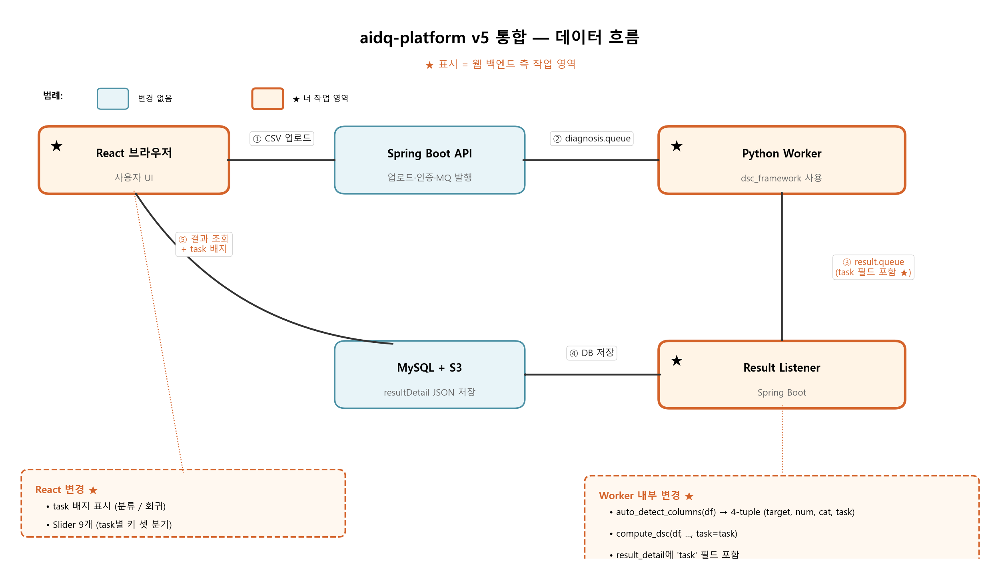

# aidq-platform 업그레이드 가이드 — DSC 엔진 v3.2 → v5

## 한 줄로

webplatform이 사용 중인 진단 엔진은 **모든 데이터를 분류로 가정**하여 회귀 데이터에 부정확한 결과를 산출함.
새 엔진(`dsc_framework`)은 **데이터를 보고 분류/회귀를 자동 판별**하고 task별 지표로 진단함.
통합 측은 webplatform에 새 엔진을 끼워넣는 작업을 진행하면 됨.

---

## 목차

1. [왜 바꾸는지](#1-왜-바꾸는지)
2. [사용자 화면이 어떻게 바뀌는지](#2-사용자-화면이-어떻게-바뀌는지)
3. [전체 데이터 흐름](#3-전체-데이터-흐름)
4. [통합 측 작업 영역 한눈에](#4-통합-측-작업-영역-한눈에)
5. [단계별 작업](#5-단계별-작업)
6. [통합 후 검증](#6-통합-후-검증)
7. [이슈 발생 시](#7-이슈-발생-시)
8. 부록 — [가중치 키 매핑](#부록-a--가중치-키-매핑) · [책임 경계](#부록-b--책임-경계) · [학술 맥락](#부록-c--왜-value_accuracy가-없어졌나)

---

## 1. v3.2 통합 이후 무엇이 바뀌었나

webplatform이 v3.2 엔진을 통합한 시점(2026-04-28) 기준으로, 본 연구는 두 단계 발전했음. 각 단계의 동기와 결과를 시간 순으로 설명.

### 1-1. v3.2 → v4 — 메타 결함 일괄 해결 (2026-04-27)

v3.2 통합 후, 본 연구에서 8지표를 메타 검증한 결과 다음 결함 발견:

- **`value_accuracy`(가중치 0.30) 정의 모순**
  - v3.2의 value_accuracy는 reference dataset과 KS-test 비교로 계산됨
  - 그런데 reference가 결국 진단 대상 dataset 자신(self-reference)이라 "데이터 품질의 절대 지표"가 아니라 "자기 자신과의 일치도"가 됨
  - 가중치 0.30으로 가장 큰 비중을 차지하는데 정의 자체가 모순적
- **DSC ↔ 모델 성능 상관 r = 0.42** — 이 모순 때문에 상관이 약함

해결책 — value_accuracy를 제거하고 절대 품질 지표 2개 신설:

| 신설 | 정의 | 가중치 |
|---|---|---:|
| `label_consistency` | k-NN 이웃 라벨 일관성, chance level 보정 | 0.20 |
| `feature_informativeness` | feature → label mutual information / H(Y) | 0.10 |

가중치 재배분: `value_accuracy` 0.30 제거 → `label_consistency` 0.20 + `feature_informativeness` 0.10. `class_balance`도 0.05 → 0.10으로 상향.

**검증 결과** (3 데이터셋 × 5 모델 × 5 polluter × 6 level):
- Pearson r: 0.420 → **0.598**
- Spearman ρ: 0.365 → 0.628
- ANOVA F: 32.9 → 84.4
- Polluter hold-out: 5/5 PASS
- 모델 5/5 모두 향상

이게 v4. webplatform이 이 시점에 통합했다면 가중치 셋이 v3.2와 다르고 `value_accuracy` 키가 사라짐.

### 1-2. v4 → v5 — Task-conditional Framework (2026-04-27 결정, 2026-05-08 Phase 1 완료)

v4는 단일 (tabular, classification) cell의 결과. 학술적으로 "framework"라 부르려면 cell이 둘 이상 필요. 그래서 v5로 확장:

- **task-conditional 정의**: `(data_type, task) → {metric_set, weights}` 매핑을 가진 framework
- **강한 버전 채택**: 차원 이름이 같아도 cell마다 정의식이 다를 수 있음. 예) `feature_correlation`은 tabular cell에선 컬럼 간 Pearson, image cell에선 ResNet embedding 간 cosine

v3.2가 "어떤 데이터든 같은 8지표로 진단"이었다면, v5는 "데이터를 보고 적절한 cell로 라우팅 후 cell별 9~10지표로 진단".

### 1-3. v5 framework 현재 구성

| Cell | 상태 | 비고 |
|---|---|---|
| **tabular × classification** (분류 cell) | ✅ 완료 | v4 결과 그대로 보존, r=0.598 |
| **tabular × regression** (회귀 cell) | 🔨 Phase 1 노트북 4개 작성 완료, Phase 2 검증 대기 | 신설: `target_distribution_quality`, `target_smoothness`, `feature_informativeness_reg`. 데이터셋: California Housing, Bike Sharing, Wine Quality |
| **image × classification** (이미지 cell) | 🔨 ADR-014 사전등록 + Phase 1 인프라 완료 | stretch goal — 캡스톤 일정상 후순위. 데이터셋: CIFAR-10, Fashion-MNIST, Flowers102 |
| 멀티모달 | ❌ Limitations | 후속 연구 명시 |

### 1-4. 왜 webplatform도 v5로 올려야 하나

발표·심사에서 webplatform이 본 연구 결과와 같은 엔진을 써야 정합성이 맞음. v3.2 유지 시:

- 본 연구: 9지표 (분류) / 9지표 (회귀) / r=0.598
- webplatform: 8지표 (분류만 가정), `value_accuracy` 0.30 포함
- → **결과 수치가 어긋나 보이고**, 심사자가 "왜 다른가" 질문 시 방어가 어려움

또 회귀 데이터를 올리면 `class_balance` 같은 의미 없는 지표가 점수에 들어가 부정확. v5는 task 자동 감지로 해결.

### 1-5. 통합 측 입장에서의 핵심 변화

- 진단 엔진 코드를 직접 포함하던 방식 → **`dsc_framework` 패키지 import**
- `compute_dsc()` 호출에 **task 파라미터 추가**
- 결과 JSON에 **task 필드 추가**
- 프론트 Slider가 **task에 따라 9개씩 분기** (분류/회귀 키 셋이 다름)

엔진 본체는 DSC 측 관리. 통합 측은 import + 호출 시그니처 + UI 분기만 손봄.

---

## 2. 사용자 화면이 어떻게 바뀌는지

통합 작업의 첫 그림 — **끝 사용자 시점의 변화**.

### 시나리오 A — 분류 데이터 업로드 (예: Iris CSV)

```
[현재 v3.2]
1. 사용자: Iris.csv 업로드
2. 화면: "DSC 점수 88점 (B)" + 8개 지표 표시
3. 화면: Slider 8개 (completeness, ..., value_accuracy)
4. 사용자: 가중치 조정 → 재진단

[v5 통합 후]
1. 사용자: Iris.csv 업로드
2. 화면: "DSC 점수 96.94점 (A)"
       + 🏷️ "이 데이터는 분류 문제로 판별되었습니다" 배지       ← NEW
       + 9개 지표 (value_accuracy 사라짐, label_consistency·feature_informativeness 등장)
3. 화면: Slider 9개 (분류용 키 셋)
4. 사용자: 가중치 조정 → 재진단
```

### 시나리오 B — 회귀 데이터 업로드 (예: California Housing CSV)

```
[현재 v3.2]
1. 사용자: california_housing.csv 업로드
2. 화면: "DSC 점수 ??점" — class_balance가 의미 없는 값으로 들어감
   (회귀 target에는 클래스 개념이 없으므로 점수가 부정확)

[v5 통합 후]
1. 사용자: california_housing.csv 업로드
2. 화면: "DSC 점수 89.74점 (B)"
       + 🏷️ "이 데이터는 회귀 문제로 판별되었습니다" 배지       ← NEW
       + 회귀용 9개 지표
         (target_distribution_quality, target_smoothness, feature_informativeness_reg 등 신규)
3. 화면: Slider 9개 (회귀용 키 셋, 분류와 다름)
```

### 시나리오 C — 자동 감지가 틀렸을 때 (선택, 1차 릴리스 제외 가능)

```
사용자: "별점 1~5인 추천 데이터" 업로드
화면: "분류로 판별됨" — 사용자는 회귀로 처리하길 원함
사용자: 배지 클릭 → "회귀로 변경" → 재진단
```

### 시나리오 D — 기존 v3.2 진단 결과 조회

```
DB에 누적된 옛날 진단(v3.2 시절)도 그대로 조회 가능.
화면에 "v3.2 (legacy)" 표시 + 기존 8개 지표 그대로 보여줌.
사용자 측 재진단 불필요.
```

---

## 3. 전체 데이터 흐름

지금까지의 흐름 + 변경 위치:



같은 흐름을 텍스트로:

```
[React 브라우저]                      ★ 작업 4 (Slider, task 배지)
    │ ① CSV 업로드
    ↓
[Spring Boot API]                     (변경 없음)
    │ ② S3 저장
    │ ③ RabbitMQ 발행 (diagnosis.queue)
    ↓
[Python Worker]                       ★ 작업 1 (핵심)
    │ ④ S3에서 CSV 다운로드
    │ ⑤ auto_detect_columns(df)
    │      ├ 기존: (target, num, cat) 3-tuple
    │      └ NEW:  (target, num, cat, task) 4-tuple    ← task 추가
    │ ⑥ compute_dsc(df, ..., task=task)                ← task 인자 추가
    │      └ 반환에 'task', 'data_type' 키 자동 포함
    │ ⑦ result.queue 발행 (resultDetail에 task 포함)
    ↓
[Result Listener]                     ★ 작업 2 (스키마 변경 없음)
    │ ⑧ result 수신 → DB 저장
    │      └ resultDetail JSON에 task 필드 자동 포함
    ↓
[MySQL + S3]                          (변경 없음)
    ↓
[React 브라우저]                      ★ 작업 4
    │ ⑨ 결과 페이지에 task 배지 표시
    │ ⑩ Slider 9개 (task에 맞는 키 셋)
```

★ 표시 3곳이 통합 측 작업 영역:
- **React 브라우저**: task 배지 표시 + Slider 9개 (task별 키 셋 분기)
- **Python Worker**: `auto_detect_columns` 4-tuple 반환, `compute_dsc(task=...)`, `result_detail`에 task 필드
- **Result Listener**: result 메시지의 task 필드를 그대로 DB에 저장 (스키마 변경 없음)

나머지(Spring Boot API의 업로드·MQ 발행, S3, MySQL 등)는 변경 없음.

---

## 4. 통합 측 작업 영역 한눈에

| 영역 | 무엇을 | 왜 |
|---|---|---|
| **0. 셋업** | `dsc_framework` 패키지를 webplatform에 가져오기 | 새 엔진 import 가능하게 |
| **1. worker.py** | `auto_detect_columns` 4-tuple, `compute_dsc(task=...)` | task 라우팅 동작 |
| **2. Listener** | `resultDetail`에 task 필드 보존 | 결과 페이지에서 task 읽기 |
| **3. 통합 테스트** | docker compose로 분류·회귀 둘 다 업로드 | 백엔드 정상 작동 확인 |
| **4. 프론트 Slider** | task에 따라 9개 키 분기 + 배지 | UX 시나리오 A·B 동작 |
| **5. LLM 프롬프트** | task별 다른 프롬프트 | 리포트가 task-aware |
| **6. EC2 배포** | 운영 반영 | 발표 데모 준비 |

**작업 순서**: 0 → 1 → 2 → 3(백엔드 테스트) → 4 → 5 → 6.

**시작 가능 시점**: 즉시. 단 EC2 배포(작업 6)는 본 연구 회귀 cell 검증 통과 후 권장.

---

## 5. 단계별 작업

### 작업 0 — 셋업

목적: webplatform이 `dsc_framework` 패키지를 import할 수 있게 함.

```bash
cd aidq-platform
git submodule add https://github.com/gary5876/capstone-dsc.git external/capstone-dsc
git submodule update --init
```

`engine/Dockerfile`에 두 줄 추가:

```dockerfile
COPY external/capstone-dsc/dsc_framework /app/dsc_framework
ENV PYTHONPATH=/app:$PYTHONPATH
```

`engine/requirements.txt`에 한 줄 추가:

```
scikit-learn>=1.3
```

확인:

```bash
docker compose build engine
docker compose run --rm engine python -c "from dsc_framework import compute_dsc; print('OK')"
```

`OK` 출력 시 통과.

---

### 작업 1 — worker.py 수정

목적: task를 자동 감지하여 새 엔진에 전달.

**1-1. import 변경 불필요** — `engine/dsc_engine.py`를 한 줄짜리 shim으로 교체:

```python
# engine/dsc_engine.py 전체 내용 (200줄을 이 두 줄로 교체)
"""DEPRECATED — v5 framework로 대체."""
from dsc_framework import compute_dsc, auto_detect_columns  # noqa: F401
```

기존 worker.py의 `from dsc_engine import compute_dsc, auto_detect_columns`는 그대로 작동.

**1-2. on_message 함수 안에서 호출 변경** (worker.py 73~89행 즈음):

```diff
-target_col, numerical_cols, categorical_cols = auto_detect_columns(df)
+target_col, numerical_cols, categorical_cols, task = auto_detect_columns(df)
+
+# 사용자가 task 강제 지정한 경우 (시나리오 C)
+task_override = message.get('task')
+if task_override:
+    task = task_override

 weights = message.get('weights', None)

 result = compute_dsc(
     df=df,
     target_col=target_col,
     numerical_cols=numerical_cols,
     categorical_cols=categorical_cols,
+    task=task,
     weights=weights,
-    reference_df=df,  # v5에서는 self-reference 의미 약함, 제거 권장 (잔존해도 작동)
 )
```

차이는 두 군데:
- `auto_detect_columns`가 4-tuple 반환 (네 번째가 task)
- `compute_dsc`에 `task=task` 추가

`result` dict는 자동으로 `task`, `data_type` 키 포함.

**1-3. result_detail JSON에 task 필드 추가** (worker.py 93~103행 즈음):

```diff
 result_detail = {
+    'task': result['task'],            # 'classification' or 'regression'
+    'data_type': result['data_type'],  # 'tabular'
-    'metrics': {k: v for k, v in result.items() if k not in ('score', 'grade')},
+    'metrics': {k: v for k, v in result.items()
+                if k not in ('score', 'grade', 'task', 'data_type')},
     'columns': [...],
     'summary': f'종합 점수 {result["score"]}점 ({result["grade"]}등급). '
-               f'분석 컬럼 {len(df.columns)-1}개, 데이터 행 {len(df)}건.',
+               f'분석 컬럼 {len(df.columns)-1}개, 데이터 행 {len(df)}건. '
+               f'task: {result["task"]}',
     'targetColumn': target_col,
     'grade': result['grade'],
 }
```

`metrics`에서 `task`/`data_type` 제외하는 것이 핵심 — 이 두 키는 metrics가 아니라 메타정보.

---

### 작업 2 — DiagnosisResultListener (Spring Boot)

목적: worker가 보낸 task 필드를 DB에 그대로 보존.

**스키마 변경 없음**. `job_results.resultDetail`이 JSON 컬럼이므로 `task` 키가 그대로 저장됨.

별도 코드 변경 거의 없음. 결과 페이지에서 검색·필터링이 필요할 경우 별도 컬럼 추가 가능 (선택):

```sql
-- 옵션 (선택): 검색 위해 별도 컬럼
ALTER TABLE jobs ADD COLUMN task VARCHAR(20);
```

캡스톤 단계는 `resultDetail.task` 직접 참조로 충분.

**v3.2 호환성**: 기존 v3.2 진단 결과는 `resultDetail`에 `task` 키가 없음. React에서 폴백:

```typescript
const task = result.resultDetail.task ?? 'legacy_v32';
```

---

### 작업 3 — 통합 테스트 (docker compose)

목적: 작업 0~2까지 정상인지 백엔드 단독 확인 (프론트 작업 진입 전).

```bash
docker compose up -d
# 분류 CSV 업로드 (Iris)
curl -F "file=@iris.csv" -F "name=test1" -F "purpose=분류 테스트" \
     http://localhost:8080/api/jobs/submit

# 잠시 후 결과 확인
curl http://localhost:8080/api/jobs/1/result
```

기대 응답:

```json
{
  "totalScore": 96.94,
  "resultDetail": {
    "task": "classification",      // ← 존재해야 함
    "data_type": "tabular",        // ← 존재해야 함
    "metrics": {
      "completeness": 1.0,
      "label_consistency": 0.89,    // ← v5 신규
      "feature_informativeness": 1.0,
      ...
      // value_accuracy 없음 (v5에서 제거)
    },
    "grade": "A"
  }
}
```

회귀 CSV(California Housing)도 업로드하여 `task=='regression'` + `target_distribution_quality` 등 회귀 키 포함 여부 확인.

---

### 작업 4 — 프론트 Slider 동적화

목적: 시나리오 A·B의 화면 동작 구현. **작업량 가장 큼**.

**4-1. task별 키 셋 분기**:

```typescript
// 새 파일 또는 기존 위치
const METRIC_KEYS: Record<'classification' | 'regression', string[]> = {
  classification: [
    'completeness', 'uniqueness', 'validity', 'consistency',
    'outlier_ratio', 'class_balance', 'feature_correlation',
    'label_consistency', 'feature_informativeness',
  ],
  regression: [
    'completeness', 'uniqueness', 'validity', 'consistency',
    'outlier_ratio', 'target_distribution_quality',
    'feature_correlation', 'target_smoothness', 'feature_informativeness_reg',
  ],
};

const METRIC_LABELS_KO: Record<string, string> = {
  completeness: '완전성',
  uniqueness: '유일성',
  validity: '유효성',
  consistency: '일관성',
  outlier_ratio: '이상치 비율',
  class_balance: '클래스 균형',
  feature_correlation: '피처 상관',
  label_consistency: '라벨 일관성',
  feature_informativeness: '피처 정보량',
  target_distribution_quality: '타겟 분포 품질',
  target_smoothness: '타겟 매끄러움',
  feature_informativeness_reg: '피처 정보량(회귀)',
};
```

**4-2. WeightSliders 컴포넌트가 task를 받아 분기**:

```typescript
function WeightSliders({ task, weights, onChange }: Props) {
  const keys = METRIC_KEYS[task];
  return (
    <>
      {keys.map(k => (
        <Slider
          key={k}
          label={METRIC_LABELS_KO[k]}
          value={weights[k]}
          onChange={v => onChange({ ...weights, [k]: v })}
        />
      ))}
      <SumValidator weights={weights} />
    </>
  );
}
```

**4-3. 결과 페이지에 task 배지**:

```typescript
function TaskBadge({ task }: { task: string }) {
  if (task === 'legacy_v32') {
    return <Tag color="default">v3.2 (legacy)</Tag>;
  }
  const color = task === 'classification' ? 'blue' : 'green';
  const label = task === 'classification' ? '분류' : '회귀';
  return <Tag color={color}>{label} 문제로 판별됨</Tag>;
}
```

**4-4. 가중치 합 검증**:

```typescript
function SumValidator({ weights }: { weights: Record<string, number> }) {
  const sum = Object.values(weights).reduce((a, b) => a + b, 0);
  const ok = Math.abs(sum - 1.0) < 0.01;
  return (
    <div style={{ color: ok ? 'green' : 'red' }}>
      합계: {sum.toFixed(2)} {ok ? '✓' : '(1.00이 되도록 조정 필요)'}
    </div>
  );
}
```

**4-5. UX 흐름**:

```
1. 사용자 CSV 업로드 (가중치 없이)
2. 진단 완료 후 결과 페이지로
   ├─ task 배지 표시
   ├─ 9개 지표 점수 표시 (task에 맞는 키)
   └─ "가중치 조정" 버튼
3. 버튼 클릭 → Slider 9개 (task에 맞는 키 셋)
4. 조정 후 "재진단" → POST 다시 (가중치 + task 동봉)
```

---

### 작업 5 — LLM 프롬프트 동적화

목적: LLM 리포트가 task-aware하도록 변경.

**5-1. 가중치 추천 프롬프트** (사용자 목적 → 가중치):

```python
def build_recommend_prompt(purpose: str, task: str) -> str:
    metric_keys = METRIC_KEYS[task]
    explanations = '\n'.join(
        f"- {k}: {METRIC_DESCRIPTIONS_KO[k]}" for k in metric_keys
    )
    task_ko = '분류' if task == 'classification' else '회귀'
    return f"""당신은 데이터 품질 전문가입니다.
사용자 목적: {purpose}
이 데이터셋은 {task_ko} 문제로 판별되었습니다.

다음 9개 지표의 가중치를 추천해주세요:
{explanations}

추천 가중치는 합이 1.00이어야 합니다."""
```

**5-2. 리포트 생성 프롬프트** — 진단 결과 dict에 이미 `task` 키가 포함되므로 그대로 전달 가능:

```python
def build_report_prompt(result: dict, purpose: str) -> str:
    task_ko = '분류' if result['task'] == 'classification' else '회귀'
    return f"""다음은 DSC v5의 {task_ko} cell 진단 결과입니다.

{json.dumps(result, indent=2, ensure_ascii=False)}

사용 목적: {purpose}

이 결과를 자연어로 해석하고 개선 가이드를 작성해 주세요.
{task_ko} 문제임을 고려해 주세요."""
```

---

## 6. 통합 후 검증

### 6-1. 작업 0~3 후 (백엔드만)

엔진 컨테이너 안에서 직접 실행:

```python
# A. import 정합성
from dsc_framework import compute_dsc, DEFAULT_WEIGHTS_CLASSIFICATION, DEFAULT_WEIGHTS_REGRESSION
assert sum(DEFAULT_WEIGHTS_CLASSIFICATION.values()) == 1.0
assert sum(DEFAULT_WEIGHTS_REGRESSION.values()) == 1.0
print('OK 가중치 합 = 1.00')

# B. 분류 (Iris) — 기대 score=96.94
import pandas as pd
from sklearn.datasets import load_iris
iris = load_iris(as_frame=True).frame
iris.columns = list(load_iris().feature_names) + ['target']
result = compute_dsc(df=iris)
assert result['task'] == 'classification'
assert result['score'] == 96.94
print(f"OK 분류: {result['score']} ({result['grade']})")

# C. 회귀 (California Housing) — 기대 score=89.74
from sklearn.datasets import fetch_california_housing
ca = fetch_california_housing(as_frame=True).frame
result = compute_dsc(df=ca)
assert result['task'] == 'regression'
assert result['score'] == 89.74
print(f"OK 회귀: {result['score']} ({result['grade']})")

# D. task override
result = compute_dsc(df=iris, task='regression')
assert result['task'] == 'regression'
print('OK override')

# E. customize 가중치
custom = {
    'completeness': 0.30, 'uniqueness': 0.10, 'validity': 0.05,
    'consistency': 0.10, 'outlier_ratio': 0.05,
    'class_balance': 0.10, 'feature_correlation': 0.05,
    'label_consistency': 0.15, 'feature_informativeness': 0.10,
}
assert abs(sum(custom.values()) - 1.0) < 1e-6
result = compute_dsc(df=iris, task='classification', weights=custom)
print(f"OK custom: {result['score']}")
```

5개 모두 통과 시 백엔드 통합 성공.

### 6-2. 작업 4~5 후 (전체 E2E)

체크리스트:

- [ ] 분류 CSV 업로드 → 결과 페이지에 "분류 문제로 판별됨" 배지 표시
- [ ] 결과 페이지에 9개 지표 (분류 키 셋) 표시, `value_accuracy` 미표시
- [ ] "가중치 조정" 버튼 → Slider 9개 (분류 키 셋)
- [ ] 회귀 CSV 업로드 → 배지 "회귀", 회귀 9개 지표 (`target_distribution_quality` 등 표시)
- [ ] 가중치 합 검증 (1.00이 안 되면 빨간색 표시)
- [ ] LLM 리포트가 task별 다른 한국어 해석
- [ ] 기존 v3.2 진단 결과(DB 누적) 조회 → "v3.2 (legacy)" 배지 + 8개 지표
- [ ] (선택) task override — 분류 → 회귀 강제 후 재진단

---

## 7. 이슈 발생 시

### 7-1. 코드 참조 위치

| 무엇이 궁금하면 | 어디 보면 됨 |
|---|---|
| `compute_dsc()`의 정확한 시그니처 | `dsc_framework/router.py` |
| 분류 cell 9개 지표가 무엇인지 | `dsc_framework/classification_cell.py` |
| 회귀 cell 9개 지표가 무엇인지 | `dsc_framework/regression_cell.py` |
| task 자동 감지 로직 | `dsc_framework/column_detection.py` |
| (옵션) 이미지 cell | `dsc_framework/image_cell.py` |

### 7-2. 자주 발생하는 이슈

**Q1. `dsc_framework` import 시 ModuleNotFoundError**
A. Dockerfile의 `ENV PYTHONPATH=/app:$PYTHONPATH` 누락. 작업 0의 두 번째 라인 확인.

**Q2. 회귀 데이터인데 `task='classification'`으로 잡힘**
A. `column_detection.py`의 `detect_task` 휴리스틱이 정수 + nunique≤20이면 분류로 분류. 사용자 측 task override로 회귀 강제 가능 (시나리오 C). 빈도 높은 케이스라면 상수 조정 가능 — DSC 측에 통보 요청.

**Q3. 가중치 합이 정확히 1.0이 되지 않음**
A. 부동소수점 오차로 0.999~1.001 발생 가능. `Math.abs(sum - 1.0) < 0.01` 정도로 허용.

**Q4. 회귀 키 셋을 분류 task에 보내면 KeyError**
A. 정상 동작. 프론트 Slider가 task별로 키 셋을 분기해야 함 (작업 4-1). `compute_dsc(df, task='classification', weights=회귀_가중치)` 호출 시 분류 cell이 회귀 키를 못 찾아 KeyError.

**Q5. webplatform에서 모델 학습도 수행하는지**
A. 아님. webplatform은 DSC 진단만 담당. 모델 학습·평가는 본 연구 노트북에서만 수행.

**Q6. 이미지 진단 통합 시점**
A. `dsc_framework`에 이미지 cell 인프라 포함됨. 본 연구 회귀 cell 검증 + 이미지 cell 검증 통과 후 진행. webplatform 입장에서는 multipart 업로드 + 이미지 polluter UI까지 추가 작업이라 별도 sprint.

---

## 부록 A — 가중치 키 매핑

| 키 | v3.2 | v5 분류 | v5 회귀 | 의미 |
|---|---:|---:|---:|---|
| completeness | 0.20 | 0.20 | 0.20 | 결측치/placeholder가 적을수록 좋음 |
| uniqueness | 0.15 | 0.15 | 0.15 | 중복 행이 적을수록 좋음 |
| validity | 0.10 | 0.05 | 0.05 | 데이터 타입/형식이 맞는 비율 |
| consistency | 0.10 | 0.10 | 0.10 | 같은 의미 값이 통일된 정도 |
| outlier_ratio | 0.05 | 0.05 | 0.05 | 이상치가 적을수록 좋음 |
| feature_correlation | 0.05 | 0.05 | 0.05 | 피처 간 고상관(>0.95)이 적을수록 좋음 |
| **class_balance** | 0.05 | 0.10 | ❌ | 클래스별 샘플 수가 균형적인 정도 |
| **value_accuracy** | 0.30 | ❌ | ❌ | (v5에서 제거 — 부록 C 참조) |
| **label_consistency** | ❌ | 0.20 | ❌ | k-NN 이웃 라벨이 일치하는 정도 |
| **feature_informativeness** | ❌ | 0.10 | ❌ | 피처가 라벨 예측에 기여하는 정도 |
| **target_distribution_quality** | ❌ | ❌ | 0.10 | 타겟 값이 골고루 분포한 정도 |
| **target_smoothness** | ❌ | ❌ | 0.20 | 비슷한 피처는 비슷한 타겟 |
| **feature_informativeness_reg** | ❌ | ❌ | 0.10 | 피처가 회귀 타겟 예측에 기여 |
| **합** | 1.00 | 1.00 | 1.00 | |

---

## 부록 B — 책임 경계

서로 안 건드릴 영역. 변경 필요 시 협의 후 진행.

| 영역 | 웹 백엔드 측 | DSC 엔진 측 |
|---|:---:|:---:|
| `dsc_framework` 패키지 본체 (정의식·가중치) | ❌ 수정 금지 | ✅ |
| webplatform 인프라 (Spring Boot, React, RabbitMQ, S3) | ✅ | ❌ |
| `engine/worker.py` 인터페이스 통합 | ✅ | ❌ |
| 사용자 가중치 customize UI | ✅ | ❌ |
| LLM 프롬프트 | ✅ | ❌ |
| 본 연구 노트북 (모델 학습·평가) | ❌ | ✅ |
| 발표·심사 데모 시나리오 | 공동 | 공동 |

---

## 부록 C — 왜 value_accuracy가 없어졌나

(통합 작업에는 알 필요 없음. 학술 맥락 참조용.)

v3.2의 `value_accuracy`는 reference dataset과 KS-test 비교로 계산되는데, 이 reference가 결국 자기 자신(self-reference)이라 정의 모순이 있었음. v4에서 절대 품질 지표인 `label_consistency`(0.20) + `feature_informativeness`(0.10)로 교체. 본 연구 메타 검증에서 이 변경으로 r=0.42 → r=0.598로 향상됨 (DSC↔모델성능 상관).

자세한 학술 맥락은 capstone-dsc repo의 다음 문서 참조:
- `documents/decisions/ADR-009-DSC엔진v4-절대품질지표교체.md`
- `documents/reports/20260427-04-v4-정식결과확정.md`

---

## 정리

| | |
|---|---|
| 핵심 변경 | task 자동 감지 → 분류/회귀에 맞는 9개 지표 |
| 시작 가능 시점 | 즉시. 단 EC2 배포는 본 연구 회귀 검증 통과 후 |
| 책임 경계 | 웹 백엔드 측 = 인프라·통합·UI / DSC 엔진 측 = 엔진 본체 |
